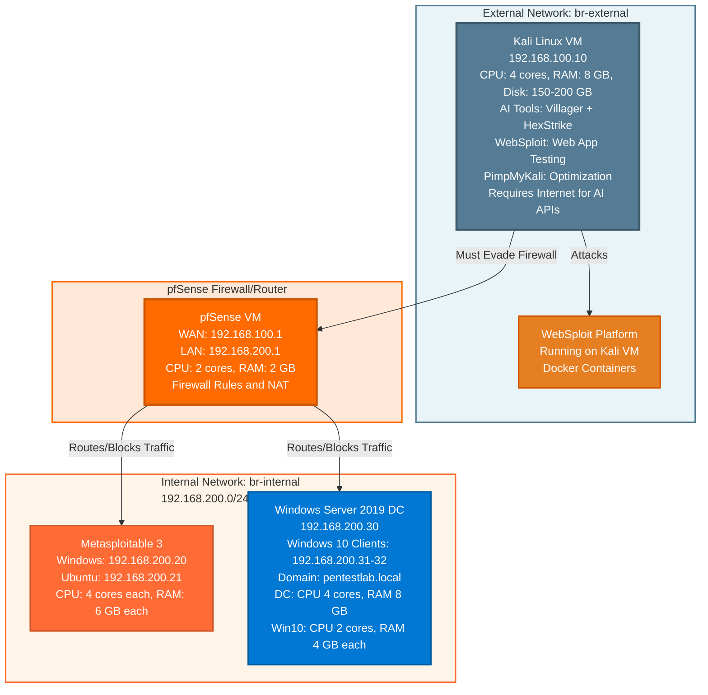
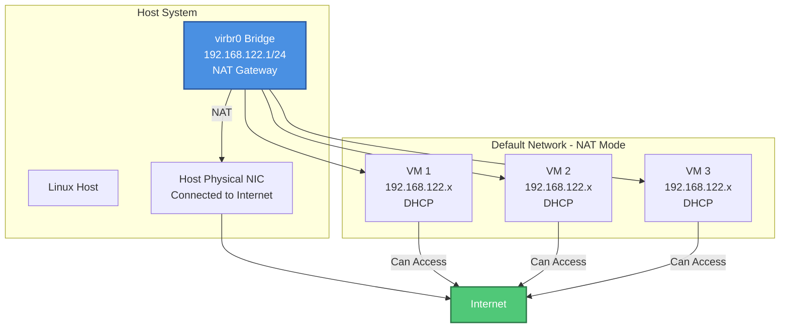
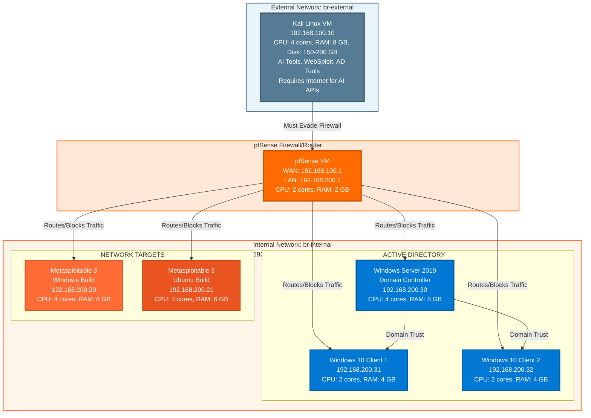
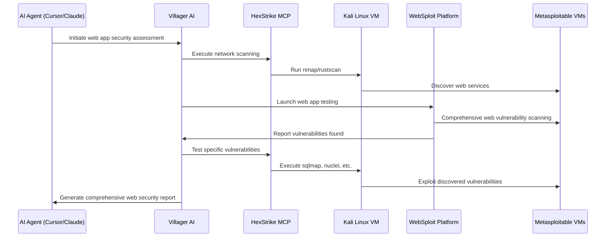
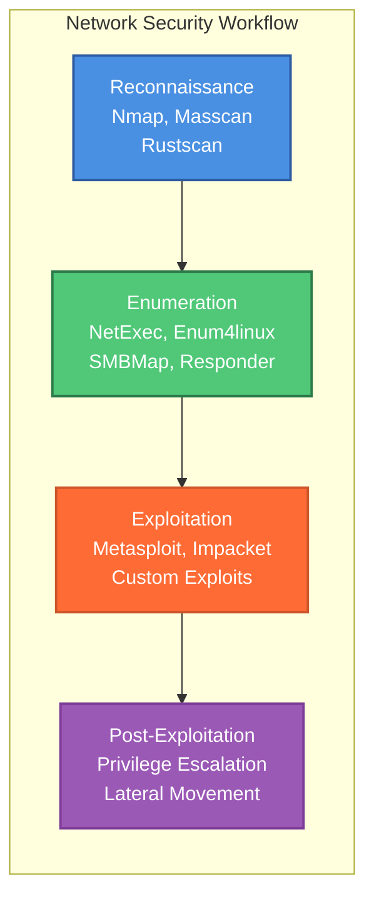
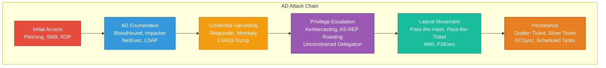
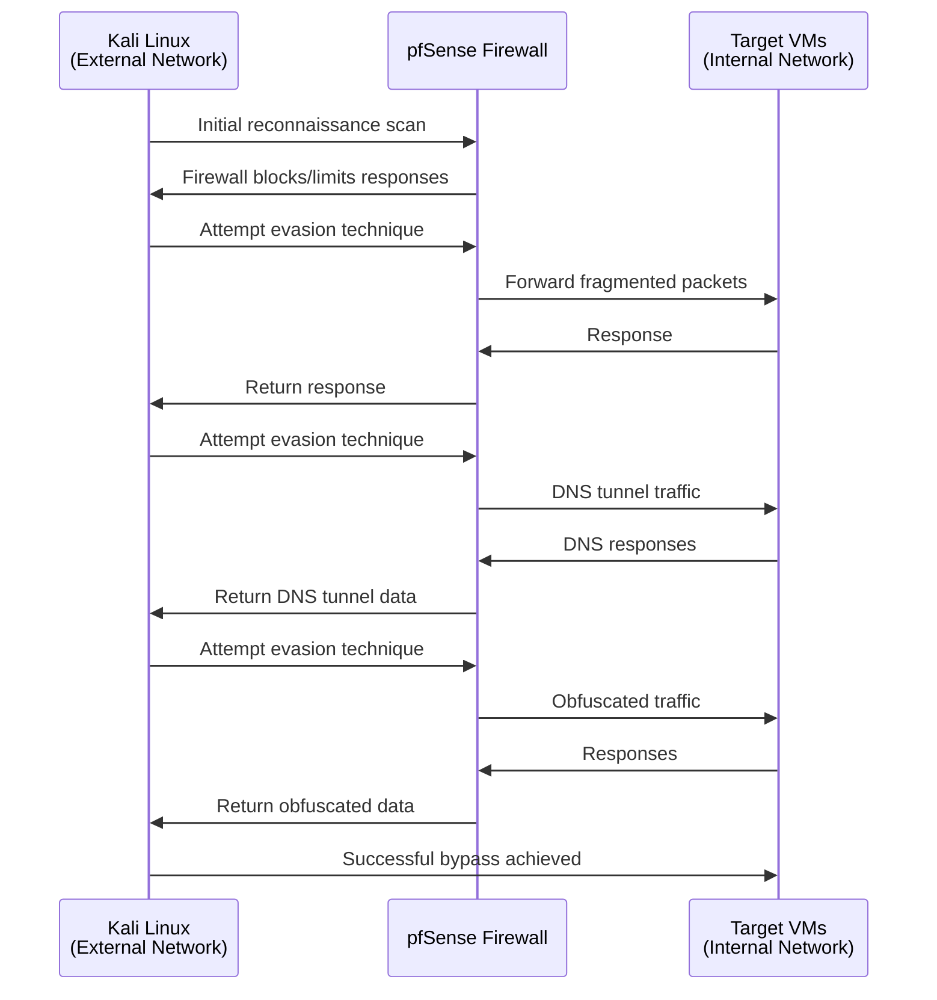
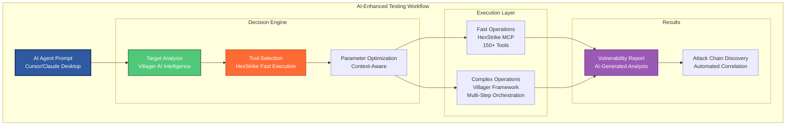

# **Cybersecurity Lab: AI-Powered Red Teaming & Penetration Testing Environment**
**Virtualized Cybersecurity Lab for Red Teaming, Web Application Security, Network Security, and Active Directory Penetration Testing**

[](https://www.qemu.org/)
[](https://www.kali.org/)
[](https://github.com/Yenn503/villager-ai-hexstrike-integration)
[](LICENSE)

---

## **Overview**
This comprehensive guide details the setup and configuration of a professional-grade cybersecurity lab environment using **QEMU/KVM** virtualization. The lab is specifically designed for **red teaming** and **penetration testing** across three primary domains:

- **🌐 Web Application Security** - OWASP Top 10, API security, modern web vulnerabilities
- **🔗 Network Security** - Network reconnaissance, exploitation, lateral movement
- **🏢 Active Directory Security** - Domain enumeration, privilege escalation, persistence

The lab leverages **AI-powered tools** including **villager-ai-hexstrike-integration** and **pimpmykali** running on **Kali Linux VMs** to automate and enhance penetration testing workflows.

**⚠️ IMPORTANT: AI Tools Requirements**
- **Internet Connection Required**: AI tools (Villager AI + HexStrike) require internet connectivity and API keys from services like Claude (Anthropic) or Cursor. These tools **cannot run offline** or with local LLMs without extremely expensive hardware.
- **Local LLM Requirements** (Not Recommended): Running AI tools locally would require:
  - 128GB+ DDR5 RAM
  - 10x NVIDIA RTX 5090 GPUs (or equivalent)
  - High-end CPU (e.g., AMD Threadripper PRO)
  - This setup is **not feasible** for most users
- **Recommended Approach**: Use API keys from Claude, Cursor, or similar cloud-based AI services. The lab VMs need internet access (via NAT network) to communicate with these AI services.

---

## **System Architecture**
### **Host System Requirements**
| Component | Minimum Specification | Recommended |
|-----------|---------------------|-------------|
| **Host OS** | Linux (Arch, Ubuntu, Debian, Fedora, etc.) | Any modern Linux distribution |
| **Virtualization** | QEMU/KVM with libvirt | QEMU/KVM with libvirt |
| **CPU** | 4 Cores (with VT-x/AMD-V) | 8+ Cores (Intel/AMD) |
| **RAM** | 16GB | 32GB+ (adjust based on your available resources) |
| **Storage** | 500GB free space | 1TB+ free space (allocate based on your needs) |
| **GPU** | Any | NVIDIA (optional, for GPU-accelerated password cracking) |
| **Internet** | ✅ **REQUIRED** | ✅ **REQUIRED** (for AI tools API access) |

**Note**: Resource allocations in this guide are recommendations. Adjust VM resources (CPU, RAM, disk) based on your available hardware. You can run fewer VMs simultaneously or reduce resource allocations per VM if needed.

### **VM Specifications Summary**
**Realistic Resource Requirements for Each VM Type**:

| VM Type | CPU Cores | RAM | Disk Space | Network | Purpose |
|---------|-----------|-----|------------|---------|---------|
| **Kali Linux** (with all tools) | 4 cores | 8 GB | 150-200 GB | br-external (192.168.100.10) | Attacker machine with AI tools, WebSploit, PimpMyKali |
| **pfSense Firewall** | 2 cores | 2 GB | 20 GB | br-external + br-internal | Firewall/router for evasion practice |
| **Metasploitable 3 (Windows)** | 4 cores | 6 GB | 60 GB | br-internal (192.168.200.20) | Vulnerable Windows target |
| **Metasploitable 3 (Ubuntu)** | 4 cores | 6 GB | 60 GB | br-internal (192.168.200.21) | Vulnerable Linux target |
| **Windows Server 2019 DC** | 4 cores | 8 GB | 100 GB | br-internal (192.168.200.30) | Domain Controller |
| **Windows 10 Client** (each) | 2 cores | 4 GB | 60 GB | br-internal (192.168.200.31-32) | Domain-joined client |

**Total Lab Resources** (All VMs Running):
- **CPU**: 20 cores minimum (24 cores recommended)
- **RAM**: 34 GB minimum (40 GB recommended)
- **Disk**: 450 GB minimum (550 GB recommended) - Increased due to Kali VM requiring 150-200 GB for AI tools
- **Internet**: ✅ **REQUIRED** (Kali VM needs internet for AI tool API access)

- **Note**: You can start with fewer VMs and scale up. For example, start with just Kali + one target VM, then add more as resources allow.

### **Lab Components**
This lab consists of four core components:

1. **Kali Linux VM** - Attacker machine with AI tools (Villager AI + HexStrike, WebSploit for web app testing, PimpMyKali)
2. **pfSense Firewall** - Enterprise firewall/router for practicing evasion techniques
3. **Metasploitable VMs** - Intentionally vulnerable Linux and Windows targets
4. **Windows Active Directory Environment** - Domain Controller and client machines

### **Lab Goals**
- **Web Application Security**: Hands-on practice with OWASP Top 10 vulnerabilities using WebSploit platform and intentionally insecure web applications on Metasploitable VMs
- **Network Security**: Develop skills in reconnaissance, enumeration, exploitation, and post-exploitation on diverse vulnerable Linux and Windows targets
- **Active Directory Security**: Simulate enterprise environments to master privilege escalation, lateral movement, and persistence techniques within a Windows domain
- **AI-Enhanced Testing**: Leverage AI tools for automated vulnerability discovery, exploit generation, and intelligent attack chain development

---

## **Network Topology**
### **Lab Architecture**
This lab uses a dual-segment network architecture with pfSense firewall separating attacker and target networks. The lab is organized into five main categories:



- **Network Architecture**:

- **External Network (br-external)**: 192.168.100.0/24
  - **Kali Linux VM**: 192.168.100.10 (4 CPU cores, 8 GB RAM, 150-200 GB disk)
  - **pfSense WAN Interface**: 192.168.100.1
  - **Note**: Kali VM requires internet access (via NAT) for AI tool API calls

- **Internal Network (br-internal)**: 192.168.200.0/24
  - **pfSense LAN Interface**: 192.168.200.1
  - **Metasploitable 3 Windows**: 192.168.200.20 (4 CPU cores, 6 GB RAM, 60 GB disk)
  - **Metasploitable 3 Ubuntu**: 192.168.200.21 (4 CPU cores, 6 GB RAM, 60 GB disk)
  - **Windows Server 2019 DC**: 192.168.200.30 (4 CPU cores, 8 GB RAM, 100 GB disk)
  - **Windows 10 Clients**: 192.168.200.31-32 (2 CPU cores each, 4 GB RAM each, 60 GB disk each)

- **Network Configuration**:
- ✅ **Dual-Segment Architecture**: External network (br-external) and Internal network (br-internal)
- ✅ **pfSense Firewall**: Separates attacker from targets, enabling realistic evasion practice
- ✅ **Internet Access for Kali**: Kali VM needs internet (via NAT) for AI tool API access (Claude, Cursor, etc.)
- ✅ **Complete Isolation for Targets**: Internal network isolated from host and internet
- ✅ **Firewall Rules**: Configured to block most traffic, requiring evasion techniques
- ✅ **Realistic Scenario**: Simulates enterprise network with perimeter defense

---

## **⚠️ AI Tools Requirements: Internet and API Keys**
- **CRITICAL**: The AI tools (Villager AI + HexStrike) used in this lab **REQUIRE internet connectivity and API keys**. They **cannot run offline** or with local LLMs without extremely expensive hardware.

### **Why Internet is Required**
The AI tools integrate with cloud-based AI services via API:
- **Claude API** (Anthropic) - Recommended
- **Cursor AI** - Alternative option
- **OpenAI API** - Alternative option

These tools make API calls to cloud-based LLMs for:
- Vulnerability analysis
- Exploit generation
- Attack chain development
- Automated testing workflows

### **Local LLM Requirements (Not Recommended)**
Running AI tools with local LLMs would require:
- **RAM**: 128GB+ DDR5 RAM
- **GPUs**: 10x NVIDIA RTX 5090 (or equivalent high-end GPUs)
- **CPU**: High-end workstation CPU (e.g., AMD Threadripper PRO 5995WX)
- **Storage**: Multiple TB of fast NVMe storage
- **Cost**: $50,000+ in hardware

**This setup is NOT feasible for most users.**

### **Recommended Approach**
1. **Use Cloud AI APIs**: Get API keys from Claude, Cursor, or similar services
2. **Internet Access for Kali VM**: Configure Kali VM with internet access (via NAT network) to reach AI APIs
3. **API Key Configuration**: Configure API keys in Villager AI and HexStrike tools
4. **Cost**: Pay-per-use API pricing (much more affordable than local hardware)

### **Network Configuration for AI Tools**
- **Kali VM**: Must have internet access (use NAT network or bridge to host network)
- **Target VMs**: Can remain isolated (no internet needed)
- **pfSense**: Can be configured to allow/block internet access as needed for testing

- **Note**: The lab setup instructions include configuring internet access for the Kali VM specifically for AI tool API calls.

---

## **1. Prerequisites: Host System Configuration**
### **1.1. Verify Hardware Virtualization Support**
Hardware virtualization extensions (Intel VT-x or AMD-V) are essential for KVM to function efficiently.

```bash
# Check CPU virtualization support
# This command counts how many CPU cores support virtualization
|egrep -c '(vmx|svm)' /proc/cpuinfo|

# Alternative: More detailed check
|grep -E '(vmx|svm)' /proc/cpuinfo|head -1|

# Check if virtualization is enabled in kernel
# For Intel: should show "vmx" flag
# For AMD: should show "svm" flag

```

- **Expected Output**:
- A number greater than 0 (e.g., 4, 8, 16) - indicates number of CPU cores with virtualization support
- Example: `8` means 8 cores support virtualization

- **Verification**:

```bash
# Verify the output
|VTX_COUNT=$(egrep -c '(vmx|svm)' /proc/cpuinfo)|
if [ "$VTX_COUNT" -gt 0 ]; then
    echo "✓ Virtualization support detected: $VTX_COUNT cores"
else
    echo "✗ Virtualization not detected. Enable in BIOS/UEFI."
    exit 1
fi

```

- **Troubleshooting**:
- If output is 0: Enable "Intel Virtualization Technology" (VT-x) or "AMD-V" (SVM) in BIOS/UEFI settings
- Reboot after enabling in BIOS
- Some systems call it "Virtualization Technology", "Intel VT-x", "AMD-V", or "SVM Mode"

### **1.2. Install QEMU/KVM and Management Tools**
#### **For Arch Linux**:

```bash
# Update package database first
sudo pacman -Sy

# Install QEMU/KVM and virtualization tools
sudo pacman -S --needed qemu virt-manager virt-viewer dnsmasq vde2 bridge-utils openbsd-netcat ebtables iptables

# Verify installation
which qemu-system-x86_64
which virt-manager
which virsh

```

- **Verification**:

```bash
# Check if packages are installed
pacman -Q qemu virt-manager libvirt 2>/dev/null && echo "✓ Packages installed" || echo "✗ Installation failed"

```

#### **For Ubuntu/Debian**:

```bash
# Update package lists
sudo apt update

# Install QEMU/KVM and virtualization tools
sudo apt install -y qemu-kvm qemu-utils libvirt-daemon-system libvirt-clients bridge-utils virt-manager virt-viewer dnsmasq

# Verify installation
which qemu-system-x86_64
which virt-manager
which virsh

```

- **Verification**:

```bash
# Check if packages are installed
dpkg -l | grep -E '(qemu|virt-manager|libvirt)' && echo "✓ Packages installed" || echo "✗ Installation failed"

```

#### **For Fedora/RHEL/CentOS**:

```bash
# Install QEMU/KVM and virtualization tools
sudo dnf install -y qemu-kvm virt-manager virt-viewer libvirt dnsmasq bridge-utils

# Verify installation
which qemu-system-x86_64
which virt-manager
which virsh

```

- **Package Explanation**:
- `qemu` / `qemu-kvm`: Core emulator and virtualizer
- `qemu-utils`: QEMU utilities (qemu-img, etc.)
- `virt-manager`: Graphical VM management tool
- `virt-viewer`: VM console viewer
- `libvirt-daemon-system` / `libvirt`: libvirt daemon and libraries
- `libvirt-clients`: Command-line tools (virsh, virt-install)
- `dnsmasq`: DHCP/DNS services for virtual networks
- `bridge-utils`: Network bridge utilities (brctl command)
- `ebtables`, `iptables`: Firewall and NAT rules (usually pre-installed)

### **1.3. Configure User Permissions**
```bash
# Get current username (more reliable than $(whoami) in some contexts)
CURRENT_USER="${USER:-$(whoami)}"

# Add user to virtualization groups
# libvirt: Required for managing VMs
# kvm: Required for KVM access
sudo usermod -aG libvirt,kvm "$CURRENT_USER"

# Verify groups were added (will show after logout/login)
groups "$CURRENT_USER" | grep -E '(libvirt|kvm)' && echo "✓ Groups added" || echo "✗ Groups not found (will appear after logout/login)"

# Note: Group changes require logout/login to take effect
# Alternative: Use newgrp to apply changes in current session (temporary)
# newgrp libvirt

```

- **Important**: You **must** log out and log back in (or reboot) for group changes to take effect. The `newgrp` command provides temporary access but is not persistent.

- **Verification After Logout/Login**:

```bash
# After logging back in, verify groups
groups | grep -E '(libvirt|kvm)' && echo "✓ User has virtualization groups" || echo "✗ Groups not active - logout/login required"

# Test libvirt access (should work without sudo)
|virsh list --all 2>&1|head -1|
# Should NOT show "permission denied" error

```

### **1.4. Start and Enable Libvirt Service**
```bash
# Enable libvirt daemon to start on boot
sudo systemctl enable libvirtd

# Start libvirt daemon immediately
sudo systemctl start libvirtd

# Verify service is running
sudo systemctl status libvirtd --no-pager -l

# Alternative: Check if service is active
if systemctl is-active --quiet libvirtd; then
    echo "✓ libvirtd is running"
else
    echo "✗ libvirtd is not running"
    sudo systemctl start libvirtd
fi

```

- **Verify KVM Kernel Modules**:

```bash
# Check if KVM modules are loaded
|lsmod|grep kvm|

# Expected output examples:
# For Intel: kvm_intel, kvm
# For AMD: kvm_amd, kvm

# Load modules if not loaded (usually auto-loaded, but verify)
# For Intel:
if ! lsmod | grep -q kvm_intel; then
    echo "Loading KVM Intel module..."
    sudo modprobe kvm_intel
fi

# For AMD:
if ! lsmod | grep -q kvm_amd; then
    echo "Loading KVM AMD module..."
    sudo modprobe kvm_amd
fi

# Verify modules loaded
|lsmod|grep kvm|

```

- **Expected Output**:
- `kvm_intel` and `kvm` modules listed (for Intel CPUs)
- `kvm_amd` and `kvm` modules listed (for AMD CPUs)

- **Complete Verification**:

```bash
# Check libvirt connection
virsh version

# Check if default network exists
virsh net-list --all

# Test virsh command (should work without sudo after group setup)
virsh list --all

```

### **1.5. Configure Storage for VMs**
Create a dedicated directory for VM storage. Choose a location based on your available disk space:

#### **Option 1: Use Default libvirt Location (Recommended)**
```bash
# Create directory if it doesn't exist
sudo mkdir -p /var/lib/libvirt/images

# Set ownership to your user (replace $USER with your username if needed)
CURRENT_USER="${USER:-$(whoami)}"
sudo chown "$CURRENT_USER:$CURRENT_USER" /var/lib/libvirt/images

# Set appropriate permissions
sudo chmod 755 /var/lib/libvirt/images

# Verify
ls -ld /var/lib/libvirt/images
# Should show your user as owner

```

#### **Option 2: Use Custom Location (For Separate Drive or More Space)**
```bash
# Choose your storage location (example: /mnt/vm-storage or /data/vms)
# Replace /mnt/vm-storage with your preferred path
VM_STORAGE="/mnt/vm-storage"

# Create directory
sudo mkdir -p "$VM_STORAGE"

# Set ownership
CURRENT_USER="${USER:-$(whoami)}"
sudo chown "$CURRENT_USER:$CURRENT_USER" "$VM_STORAGE"

# Set permissions
sudo chmod 755 "$VM_STORAGE"

# Verify
ls -ld "$VM_STORAGE"

```

- **Note**: If using a custom location, you'll need to specify it when creating VMs in virt-manager or use `virsh` commands with full paths.

#### **Option 3: Use Home Directory (Limited Space Scenarios)**
```bash
# Create VM storage in home directory
mkdir -p ~/vm-storage

# Verify
ls -ld ~/vm-storage

```

#### **Check Available Disk Space**
```bash
# Check available space on all filesystems
df -h

# Check space in default libvirt location
df -h /var/lib/libvirt/images

# Check space in home directory
df -h ~

# For custom location (if set)
# df -h /mnt/vm-storage

```

- **Storage Tips**:
- **Use qcow2 format**: Thin provisioning saves space (disk grows as needed)
- **Monitor regularly**: Run `df -h` frequently to track usage
- **Default location**: `/var/lib/libvirt/images` is used by virt-manager by default
- **Custom location**: Requires specifying path when creating VMs
- **Space planning**: Each VM typically needs 20-100GB depending on OS and usage

### **1.6. Enable Nested Virtualization (Optional but Recommended)**
Nested virtualization allows running hypervisors inside VMs (e.g., Docker Desktop, WSL2, or nested KVM).

#### **Detect CPU Type First**
```bash
# Check CPU vendor
|CPU_VENDOR=$(grep -m1 vendor_id /proc/cpuinfo|awk '{print $3}')|

if [ "$CPU_VENDOR" = "GenuineIntel" ]; then
    echo "Intel CPU detected"
    CPU_TYPE="intel"
elif [ "$CPU_VENDOR" = "AuthenticAMD" ]; then
    echo "AMD CPU detected"
    CPU_TYPE="amd"
else
    echo "Unknown CPU vendor: $CPU_VENDOR"
    exit 1
fi

```

#### **Enable Nested Virtualization**
- **For Intel CPUs**:

```bash
# Create modprobe configuration
|echo "options kvm-intel nested=1"|sudo tee /etc/modprobe.d/kvm-intel.conf|

# Verify file was created
cat /etc/modprobe.d/kvm-intel.conf

# Unload and reload module (requires no running VMs)
# First, check if any VMs are running
if virsh list --state-running 2>/dev/null | grep -q running; then
    echo "⚠️  VMs are running. Shut them down first, then run:"
    echo "   sudo modprobe -r kvm_intel && sudo modprobe kvm_intel nested=1"
else
    sudo modprobe -r kvm_intel
    sudo modprobe kvm_intel nested=1
fi

```

- **For AMD CPUs**:

```bash
# Create modprobe configuration
|echo "options kvm-amd nested=1"|sudo tee /etc/modprobe.d/kvm-amd.conf|

# Verify file was created
cat /etc/modprobe.d/kvm-amd.conf

# Unload and reload module (requires no running VMs)
if virsh list --state-running 2>/dev/null | grep -q running; then
    echo "⚠️  VMs are running. Shut them down first, then run:"
    echo "   sudo modprobe -r kvm_amd && sudo modprobe kvm_amd nested=1"
else
    sudo modprobe -r kvm_amd
    sudo modprobe kvm_amd nested=1
fi

```

#### **Verify Nested Virtualization**
```bash
# Check if nested virtualization is enabled
# For Intel:
if [ -f /sys/module/kvm_intel/parameters/nested ]; then
    NESTED=$(cat /sys/module/kvm_intel/parameters/nested)
    if [ "$NESTED" = "Y" ] || [ "$NESTED" = "1" ]; then
        echo "✓ Nested virtualization enabled for Intel"
    else
        echo "✗ Nested virtualization not enabled"
    fi
fi

# For AMD:
if [ -f /sys/module/kvm_amd/parameters/nested ]; then
    NESTED=$(cat /sys/module/kvm_amd/parameters/nested)
    if [ "$NESTED" = "Y" ] || [ "$NESTED" = "1" ]; then
        echo "✓ Nested virtualization enabled for AMD"
    else
        echo "✗ Nested virtualization not enabled"
    fi
fi

```

- **Important**:
- Changes require **reboot** to persist permanently
- If you can't reboot immediately, the modprobe commands above provide temporary enablement
- Shut down all VMs before reloading modules
- After reboot, nested virtualization will be enabled automatically

---

## **2. Network Setup: Understanding libvirt Networking**
### **Quick Reference: Network Types**
| Network | Type | Internet | Host Access | Use Case | For This Lab |
|---------|------|----------|-------------|----------|--------------|
| **default (virbr0)** | NAT | ✅ Yes | ✅ Yes | General VMs | ❌ Not used |
| **br-external** | Isolated | ❌ No | ❌ No | Attacker network | ✅ **Use this** |
| **br-internal** | Isolated | ❌ No | ❌ No | Target network | ✅ **Use this** |

- **For This Lab**: Use **br-external** (192.168.100.0/24) for Kali VM and **br-internal** (192.168.200.0/24) for target VMs. pfSense connects both networks, providing firewall separation for evasion practice.

---

### **2.1. Understanding libvirt Default Network (virbr0)**
When you install libvirt, it automatically creates a default NAT network called `default` (bridge interface: `virbr0`). Understanding this default network is important before creating custom networks.

#### **Default NAT Network (virbr0) - How It Works**


- **Default Network Characteristics**:
- **Network Name**: `default`
- **Bridge Interface**: `virbr0`
- **IP Range**: `192.168.122.0/24`
- **Gateway**: `192.168.122.1` (libvirt host)
- **Mode**: NAT (Network Address Translation)
- **Internet Access**: ✅ Yes (VMs can reach internet through host)
- **Host Access**: ✅ Yes (VMs can access host)
- **VM-to-VM Communication**: ✅ Yes (VMs on same network can communicate)
- **Isolation**: ❌ No (VMs can access internet and host network)

#### **Check Default Network Status**
```bash
# List all libvirt networks
virsh net-list --all

# Check default network details
virsh net-info default

# View default network XML configuration
virsh net-dumpxml default

# Check virbr0 bridge interface
ip a show virbr0

# Check NAT rules (iptables)
|sudo iptables -t nat -L -n -v|grep virbr0|

```

- **Expected Output**: You should see `default` network active with bridge `virbr0` and IP `192.168.122.1`

### **2.2. Network Types: NAT vs Isolated**
This lab uses an **isolated network** for security and isolation. Here's a comparison:

| Feature | Default NAT (virbr0) | Isolated Networks (br-external/br-internal) |
|---------|---------------------|--------------------------|
| **Internet Access** | ✅ Yes (through NAT) | ❌ No (completely isolated) |
| **Host Network Access** | ✅ Yes | ❌ No |
| **VM-to-VM Communication** | ✅ Yes | ✅ Yes |
| **Security** | Lower (internet exposure) | Higher (complete isolation) |
| **Use Case** | General VMs needing internet | Security labs, testing environments |
| **DHCP** | ✅ Automatic | ✅ Automatic |
| **DNS** | ✅ Automatic (via host) | ❌ No (unless configured) |

- **When to Use Each**:

- **Default NAT (virbr0)**:
  - VMs that need internet access (updates, downloads)
  - General-purpose virtual machines
  - Development environments
  - When you want automatic internet connectivity

- **Isolated Networks (br-external/br-internal)**:
  - Security testing labs (this guide)
  - Penetration testing environments
  - Network security practice
  - When you want complete network isolation

### **2.3. Creating Dual-Segment Lab Networks**
This lab uses **two isolated networks** separated by pfSense firewall:
- **br-external** (192.168.100.0/24): Attacker network (Kali VM)
- **br-internal** (192.168.200.0/24): Target network (Metasploitable, AD VMs)

#### **Step 1: Create External Network Definition (br-external)**
```bash
# Create network XML definition for external network (attacker side)
NETWORK_XML="/tmp/br-external.xml"

# Create the XML file with proper formatting
cat > "$NETWORK_XML" <<'EOF'
<network>
  <name>br-external</name>
  <bridge name="br-external"/>
  <forward mode='isolated'/>
  <ip address='192.168.100.1' netmask='255.255.255.0'>
    <dhcp>
      <range start='192.168.100.100' end='192.168.100.200'/>
    </dhcp>
  </ip>
</network>
EOF

# Verify XML file was created and has content
if [ -f "$NETWORK_XML" ] && [ -s "$NETWORK_XML" ]; then
    echo "✓ Network XML file created: $NETWORK_XML"
    # Display file contents for verification
    cat "$NETWORK_XML"
else
    echo "✗ Failed to create network XML file"
    exit 1
fi

# Validate XML syntax (if xmllint is available)
if command -v xmllint >/dev/null 2>&1; then
    if xmllint --noout "$NETWORK_XML" 2>/dev/null; then
        echo "✓ XML syntax is valid"
    else
        echo "⚠️  XML validation failed (xmllint not available or XML invalid)"
    fi
fi

```

- **Network Configuration Explained**:
- **`<name>br-external</name>`**: Network name in libvirt
- **`<bridge name="br-external"/>`**: Linux bridge interface name
- **`<forward mode='isolated'/>`**: No forwarding to host/internet (isolated)
- **`<ip address='192.168.100.1'/>`**: Gateway IP for this network
- **`<dhcp><range>`**: DHCP IP range for automatic VM IP assignment

#### **Step 2: Create Internal Network Definition (br-internal)**
```bash
# Create network XML definition for internal network (target side)
NETWORK_XML="/tmp/br-internal.xml"

# Create the XML file with proper formatting
cat > "$NETWORK_XML" <<'EOF'
<network>
  <name>br-internal</name>
  <bridge name="br-internal"/>
  <forward mode='isolated'/>
  <ip address='192.168.200.1' netmask='255.255.255.0'>
    <dhcp>
      <range start='192.168.200.100' end='192.168.200.200'/>
    </dhcp>
  </ip>
</network>
EOF

# Verify XML file was created
if [ -f "$NETWORK_XML" ] && [ -s "$NETWORK_XML" ]; then
    echo "✓ Internal network XML file created: $NETWORK_XML"
    cat "$NETWORK_XML"
else
    echo "✗ Failed to create internal network XML file"
    exit 1
fi

```

#### **Step 3: Define and Start Both Networks**
```bash
# Function to create a network
create_network() {
    local NETWORK_XML="$1"
    local NETWORK_NAME="$2"

    # Check if network already exists
    if virsh net-info "$NETWORK_NAME" >/dev/null 2>&1; then
        echo "⚠️  Network '$NETWORK_NAME' already exists"
|if virsh net-info "$NETWORK_NAME"|grep -q "Active:.**yes"; then|
            echo "Network is already active. Skipping creation."
            return 0
        else
            echo "Network exists but is inactive. Starting it..."
            virsh net-start "$NETWORK_NAME"
            return 0
        fi
    fi

    # Define the network
    echo "Defining network '$NETWORK_NAME'..."
    if virsh net-define "$NETWORK_XML"; then
        echo "✓ Network '$NETWORK_NAME' defined successfully"
    else
        echo "✗ Failed to define network '$NETWORK_NAME'"
        return 1
    fi

    # Start the network
    echo "Starting network '$NETWORK_NAME'..."
    if virsh net-start "$NETWORK_NAME"; then
        echo "✓ Network '$NETWORK_NAME' started successfully"
    else
        echo "✗ Failed to start network '$NETWORK_NAME'"
        echo "Check logs: sudo journalctl -u libvirtd -n 50"
        return 1
    fi

    # Enable autostart
    echo "Enabling autostart for network '$NETWORK_NAME'..."
    if virsh net-autostart "$NETWORK_NAME"; then
        echo "✓ Autostart enabled for '$NETWORK_NAME'"
    else
        echo "✗ Failed to enable autostart for '$NETWORK_NAME'"
        return 1
    fi

    return 0
}

# Create external network (attacker side)
echo "=== Creating External Network (br-external) ==="
create_network "/tmp/br-external.xml" "br-external"

# Create internal network (target side)
echo -e "\n=== Creating Internal Network (br-internal) ==="
create_network "/tmp/br-internal.xml" "br-internal"

# Clean up temporary XML files (optional)
# rm -f /tmp/br-external.xml /tmp/br-internal.xml

```

#### **Step 4: Verify Both Networks**
```bash
# Verify both networks exist and are active
echo "=== Listing all networks ==="
virsh net-list --all

# Verify external network
if virsh net-list --all | grep -q "br-external"; then
    echo "✓ External network (br-external) is listed"
    virsh net-info br-external
else
    echo "✗ External network (br-external) not found"
fi

# Verify internal network
if virsh net-list --all | grep -q "br-internal"; then
    echo "✓ Internal network (br-internal) is listed"
    virsh net-info br-internal
else
    echo "✗ Internal network (br-internal) not found"
fi

# Check bridge interfaces
echo -e "\n=== Bridge Interface Status ==="
for BRIDGE in br-external br-internal; do
    if ip link show "$BRIDGE" >/dev/null 2>&1; then
        echo "✓ Bridge interface '$BRIDGE' exists"
        ip a show "$BRIDGE"
    else
        echo "✗ Bridge interface '$BRIDGE' not found"
    fi
done

# Check if network already exists
if virsh net-info "$NETWORK_NAME" >/dev/null 2>&1; then
    echo "⚠️  Network '$NETWORK_NAME' already exists"
    echo "Checking if it's active..."
|if virsh net-info "$NETWORK_NAME"|grep -q "Active:.**yes"; then|
        echo "Network is already active. Skipping creation."
    else
        echo "Network exists but is inactive. Starting it..."
        virsh net-start "$NETWORK_NAME"
    fi
else
    # Define the network (creates configuration in libvirt)
    echo "Defining network '$NETWORK_NAME'..."
    if virsh net-define "$NETWORK_XML"; then
        echo "✓ Network defined successfully"
    else
        echo "✗ Failed to define network"
        exit 1
    fi

    # Start the network (activates bridge and DHCP)
    echo "Starting network '$NETWORK_NAME'..."
    if virsh net-start "$NETWORK_NAME"; then
        echo "✓ Network started successfully"
    else
        echo "✗ Failed to start network"
        echo "Check logs: sudo journalctl -u libvirtd -n 50"
        exit 1
    fi

    # Enable autostart (network starts automatically on host boot)
    echo "Enabling autostart for network '$NETWORK_NAME'..."
    if virsh net-autostart "$NETWORK_NAME"; then
        echo "✓ Autostart enabled"
    else
        echo "✗ Failed to enable autostart"
        exit 1
    fi
fi

# Clean up temporary XML file (optional)
# rm -f "$NETWORK_XML"

```

#### **Step 4: Verify Both Networks**
```bash
# Function to verify a network
verify_network() {
    local NETWORK_NAME="$1"
    local GATEWAY_IP="$2"

    echo "=== Verifying Network: $NETWORK_NAME ==="

    # Check if network is listed
if virsh net-list --all | grep -q "$NETWORK_NAME"; then
        echo "✓ Network '$NETWORK_NAME' is listed"
    else
        echo "✗ Network '$NETWORK_NAME' not found"
        return 1
    fi

    # Show detailed network information
    virsh net-info "$NETWORK_NAME"

    # Verify network is active
if virsh net-info "$NETWORK_NAME" | grep -q "Active:.*yes"; then
        echo "✓ Network is active"
    else
        echo "✗ Network is not active - starting..."
        virsh net-start "$NETWORK_NAME"
    fi

    # Check bridge interface exists
    if ip link show "$NETWORK_NAME" >/dev/null 2>&1; then
        echo "✓ Bridge interface '$NETWORK_NAME' exists"
        ip a show "$NETWORK_NAME"
    else
        echo "✗ Bridge interface '$NETWORK_NAME' not found"
        return 1
    fi

    # Verify DHCP service
    if pgrep -f "dnsmasq.*$NETWORK_NAME" >/dev/null; then
        echo "✓ dnsmasq is running for network '$NETWORK_NAME'"
    else
        echo "⚠️  dnsmasq not running (may start automatically)"
    fi

    echo ""
}

# Verify external network (br-external)
verify_network "br-external" "192.168.100.1"

# Verify internal network (br-internal)
verify_network "br-internal" "192.168.200.1"

# List all networks
echo "=== All Networks ==="
virsh net-list --all

```

- **Expected Output**:

```

Name          State    Autostart   Persistent
--------------------------------------------
default       active   yes         yes
br-external   active   yes         yes
br-internal   active   yes         yes

```

- **Complete Verification Script**:

```bash
#!/bin/bash
# Complete network verification script

NETWORK_NAME="br-lab"

echo "=== Comprehensive Network Verification ==="

# Check if network exists
if virsh net-info "$NETWORK_NAME" >/dev/null 2>&1; then
    echo "✓ Network '$NETWORK_NAME' exists"

    # Check if active
if virsh net-info "$NETWORK_NAME" | grep -q "Active:.*yes"; then
        echo "✓ Network is active"
    else
        echo "✗ Network is not active - starting it..."
        virsh net-start "$NETWORK_NAME"
    fi

    # Check bridge
    if ip link show "$NETWORK_NAME" >/dev/null 2>&1; then
        echo "✓ Bridge interface exists"
    else
        echo "✗ Bridge interface missing"
    fi

    # Check DHCP
    if pgrep -f "dnsmasq.**$NETWORK_NAME" >/dev/null; then
        echo "✓ DHCP service running"
    else
        echo "⚠️  DHCP service not running (may start automatically)"
    fi

    echo "✓ Network verification complete"
else
    echo "✗ Network '$NETWORK_NAME' does not exist"
    echo "Run network creation steps first"
    exit 1
fi

```

#### **Step 4: Network Configuration Details**
| Network Component | External Network (br-external) | Internal Network (br-internal) |
|------------------|------------------------------|-------------------------------|
| **Network Name** | `br-external` | `br-internal` |
| **Bridge Interface** | `br-external` | `br-internal` |
| **Network Range** | `192.168.100.0/24` | `192.168.200.0/24` |
| **Gateway IP** | `192.168.100.1` | `192.168.200.1` |
| **DHCP Range** | `192.168.100.100-200` | `192.168.200.100-200` |
| **Static IP Range** | `192.168.100.10-99` | `192.168.200.10-99` |
| **Forward Mode** | `isolated` | `isolated` |
| **Purpose** | Attacker network (Kali VM) | Target network (Metasploitable, AD) |
| **Internet Access** | Via NAT (for AI tool APIs) | ❌ No internet |

### **2.4. Network Configuration Options**
#### **Option A: Using Isolated Network (Recommended for This Lab)**
- **Configuration**:

```xml
<network>
  <name>br-lab</name>
  <bridge name="br-lab"/>
  <forward mode='isolated'/>
  <ip address='192.168.100.1' netmask='255.255.255.0'>
    <dhcp>
      <range start='192.168.100.100' end='192.168.100.200'/>
    </dhcp>
  </ip>
</network>

```

- **Characteristics**:
- ✅ Complete isolation from host and internet
- ✅ VMs can communicate with each other
- ✅ Safe for security testing
- ❌ No internet access (VMs cannot download updates)
- ❌ No access to host network

- **Use When**: Security labs, penetration testing, complete isolation needed

#### **Option B: Using Default NAT Network (virbr0)**
- **Configuration**: Already exists, no setup needed

- **Characteristics**:
- ✅ Internet access through NAT
- ✅ Access to host network
- ✅ Automatic DHCP and DNS
- ❌ Less secure (internet exposure)
- ❌ VMs can reach external networks

- **Use When**: VMs need internet access, general-purpose use

- **To Use Default Network**:

```bash
# In virt-manager: Select "default" network when creating VM
# Or via command line:
virsh attach-interface <vm-name> --type network --source default --model virtio

```

#### **Option C: Custom NAT Network (Advanced)**
If you want a custom NAT network (different IP range, still with internet access):

```bash
tee /tmp/br-custom-nat.xml <<EOF
<network>
  <name>br-custom-nat</name>
  <bridge name="br-custom-nat"/>
  <forward mode='nat'>
    <nat>
      <port start='1024' end='65535'/>
    </nat>
  </forward>
  <ip address='192.168.200.1' netmask='255.255.255.0'>
    <dhcp>
      <range start='192.168.200.100' end='192.168.200.200'/>
    </dhcp>
  </ip>
</network>
EOF

virsh net-define /tmp/br-custom-nat.xml
virsh net-start br-custom-nat
virsh net-autostart br-custom-nat

```

#### **Option D: Routed Network (Advanced)**
For direct access to physical network (no NAT):

```bash
tee /tmp/br-routed.xml <<EOF
<network>
  <name>br-routed</name>
  <bridge name="br-routed"/>
  <forward mode='route' dev='eth0'/>
  <ip address='192.168.1.1' netmask='255.255.255.0'>
    <dhcp>
      <range start='192.168.1.100' end='192.168.1.200'/>
    </dhcp>
  </ip>
</network>
EOF

```

- **Note**: Routed networks require proper network configuration and are more complex.

### **2.5. Configuring VMs to Use Different Networks**
#### **Method 1: During VM Creation (virt-manager)**
1. Open virt-manager
2. Create new VM or edit existing VM
3. Go to "Network selection" step
4. Choose network:
   - **"default"** for NAT (internet access) - Use for Kali VM's second interface
   - **"br-external"** for external attacker network (Kali VM)
   - **"br-internal"** for internal target network (Metasploitable, Windows AD)
5. Select network model: `virtio` (recommended for performance)

#### **Method 2: Via Command Line (virsh)**
```bash
# List current network interfaces for VM
virsh domiflist <vm-name>

# Remove existing network interface (if needed)
virsh detach-interface <vm-name> --type network --mac <mac-address>

# Attach VM to specific network
# For Kali VM: Use br-external
# For target VMs: Use br-internal
virsh attach-interface <vm-name> --type network --source br-external --model virtio --config
# OR
virsh attach-interface <vm-name> --type network --source br-internal --model virtio --config

# For persistent change (survives reboot), add --config flag
# For immediate change (without --config), change takes effect immediately

```

#### **Method 3: Edit VM XML Directly**
```bash
# Edit VM configuration
virsh edit <vm-name>

# Find <interface> section and modify:
<interface type='network'>
  <source network='br-external'/>  <!-- For Kali VM -->
  <!-- OR -->
  <source network='br-internal'/>  <!-- For target VMs (Metasploitable, Windows AD) -->
  <model type='virtio'/>
</interface>

# Save and exit (libvirt validates XML automatically)

```

### **2.6. Network Troubleshooting and Verification**
#### **Verify Network Connectivity**
```bash
# On Host: Check network status
virsh net-list --all
virsh net-info br-external
virsh net-info br-internal
ip a show br-external
ip a show br-internal

# On Host: Check DHCP leases
virsh net-dhcp-leases br-external
virsh net-dhcp-leases br-internal

# On VM: Check IP assignment
# Linux: ip a or ifconfig
# Windows: ipconfig

# On VM: Test connectivity
# From Kali VM (br-external):
ping 192.168.100.1  # Gateway (should work)
ping 8.8.8.8        # Internet (should work if NAT interface configured)

# From target VMs (br-internal):
ping 192.168.200.1  # Gateway (should work)
ping 192.168.200.20 # Another VM on internal network (should work)
ping 8.8.8.8        # Internet (should FAIL - isolated network)

```

#### **Common Network Issues**
**Problem: VM not getting IP address**

```bash
# Check network is running (check both networks)
virsh net-info br-external
virsh net-info br-internal

# Restart network (replace with br-external or br-internal as needed)
virsh net-destroy br-external
virsh net-start br-external
# OR
virsh net-destroy br-internal
virsh net-start br-internal

# Check dnsmasq process
|ps aux|grep dnsmasq|

# Restart libvirt (restarts dnsmasq)
sudo systemctl restart libvirtd

```

**Problem: VMs cannot ping each other**

```bash
# Verify both VMs are on same network
virsh domiflist <vm1-name>
virsh domiflist <vm2-name>
# Both should show same network (br-external or br-internal)

# Check bridge connectivity (check appropriate network)
brctl show br-external  # For Kali VM
brctl show br-internal  # For target VMs
# Should show VM interfaces connected

# Check VM firewalls (may block ping)
# Linux: sudo ufw disable (temporarily for testing)
# Windows: Disable Windows Firewall temporarily

```

**Problem: Want to switch VM between networks**

```bash
# Remove from current network
virsh detach-interface <vm-name> --type network --mac <mac-address> --config

# Add to new network
virsh attach-interface <vm-name> --type network --source br-lab --model virtio --config

# Reboot VM for changes to take effect

```

### **2.7. Network Configuration Summary**
- **For This Lab (Isolated Network)**:

| Setting | Value | Notes |
|---------|-------|-------|
| **Network Name** | `br-lab` | libvirt identifier |
| **Bridge** | `br-lab` | Linux bridge interface |
| **Mode** | `isolated` | No host/internet access |
| **Subnet** | `192.168.100.0/24` | Lab network range |
| **Gateway** | `192.168.100.1` | libvirt host (not routable) |
| **DHCP Range** | `192.168.100.100-200` | Automatic IPs |
| **Static IPs** | `192.168.100.10-99` | Manual assignment |
| **Internet Access** | ❌ No | Complete isolation |
| **VM Communication** | ✅ Yes | VMs can talk to each other |

- **Default Network (For Reference)**:

| Setting | Value | Notes |
|---------|-------|-------|
| **Network Name** | `default` | Pre-configured |
| **Bridge** | `virbr0` | Auto-created |
| **Mode** | `nat` | NAT with internet |
| **Subnet** | `192.168.122.0/24` | Default range |
| **Gateway** | `192.168.122.1` | libvirt host |
| **DHCP Range** | `192.168.122.2-254` | Automatic |
| **Internet Access** | ✅ Yes | Through NAT |
| **VM Communication** | ✅ Yes | VMs can talk to each other |

---

## **3. Deploying Lab VMs**
### **3.1. Attacker Machine: Kali Linux VM**
#### **VM Specifications**
| Resource | Realistic Allocation | Minimum (if resources limited) |
|----------|---------------------|-------------------------------|
| **CPU** | 4 Cores | 2 Cores |
| **RAM** | 8 GiB | 4 GiB |
| **Disk** | 150-200 GiB (qcow2 format) | 100 GiB |
| **Network** | br-external (Static IP: 192.168.100.10) + NAT for internet | br-external + NAT |
| **OS** | Kali Linux (Latest) | Kali Linux (Latest) |
| **Internet** | ✅ **REQUIRED** (for AI tool API access) | ✅ **REQUIRED** |

- **Realistic Requirements**:
- **4 CPU cores**: Needed for running multiple tools simultaneously (AI tools, WebSploit, Metasploit, etc.)
- **8 GB RAM**: Required for Docker containers (WebSploit), AI tool processes, and multiple penetration testing tools
- **150-200 GB disk**: Space for OS, AI tools, Docker images (WebSploit), tool caches, generated data, and AI tool logs. AI tools can generate significant data, so 200 GB is recommended if available.
- **Internet Access**: **CRITICAL** - Required for AI tool API calls (Claude, Cursor, etc.)

- **Note**: The Kali VM needs internet access (via NAT network) for AI tools to function. Configure a second network interface with NAT for internet access while keeping br-external for lab network communication.

#### **Installation Steps**
1. **Download Kali Linux ISO**:
   - Visit [kali.org/get-kali](https://www.kali.org/get-kali/)
   - Download the latest ISO image

2. **Create VM in virt-manager**:
   ```bash
   # Open virt-manager
   virt-manager
   ```

   - Click "Create a new virtual machine"
   - Select "Local install media (ISO image or CDROM)"
   - Browse and select Kali Linux ISO
   - Choose "Linux" → "Debian 11" or latest
   - Allocate resources: 4 CPU, 8GB RAM, 150-200GB disk (200GB recommended for AI tools)
   - **Before finishing**: Check "Customize configuration before install"
   - **Network Configuration** (Critical Step):
     * Click "Add Hardware" → "Network"
     * **First Interface**: Select **"br-external"** network (for lab network)
       - Network model: Select **"virtio"** for best performance
       - Static IP will be: 192.168.100.10
     * **Second Interface**: Select **"default"** network (for internet access)
       - This provides NAT internet access for AI tool API calls
       - Network model: Select **"virtio"** for best performance
     * **Why two interfaces?**:
       - br-external: Communication with lab targets through pfSense
       - default (NAT): Internet access for AI tool API calls (Claude, Cursor, etc.)
   - Click "Begin Installation"

   - **Note**: Kali VM needs TWO network interfaces:
   - **br-external**: For lab network (192.168.100.10)
   - **default (NAT)**: For internet access (AI tool APIs)

3. **Install Kali Linux**:
   - Follow standard installation process
   - Set up user account and password
   - Complete installation and reboot

4. **Post-Installation Configuration**:

   - **Update System**:
   ```bash
   # Update package lists
   sudo apt update

   # Check if update was successful
   if [ $? -eq 0 ]; then
       echo "✓ Package lists updated"
       # Upgrade system packages
       sudo apt full-upgrade -y
   else
       echo "✗ Failed to update package lists"
       echo "Check internet connection and try again"
       exit 1
   fi
   ```

   **Install PimpMyKali** (Essential for Kali VM optimization):

   PimpMyKali fixes common issues with Kali Linux tools and optimizes the system for penetration testing.

   **Step 1: Navigate to Home Directory**

   ```bash
   # Navigate to home directory
   cd ~ || exit 1
   ```

   **Step 2: Clone PimpMyKali Repository**

   ```bash
   # Check if pimpmykali directory already exists
   if [ -d "pimpmykali" ]; then
       echo "⚠️  pimpmykali directory already exists"
       read -p "Remove existing directory and re-clone? (y/n) " -n 1 -r
       echo
       if [[ $REPLY =~ ^[Yy]$ ]]; then
           rm -rf pimpmykali
       else
           cd pimpmykali || exit 1
       fi
   fi

   # Clone repository if directory doesn't exist
   if [ ! -d "pimpmykali" ]; then
       echo "Cloning PimpMyKali repository..."
       if git clone https://github.com/Dewalt-arch/pimpmykali.git; then
           echo "✓ Repository cloned successfully"
           cd pimpmykali || exit 1
       else
           echo "✗ Failed to clone repository"
           echo "Check internet connection and try again"
           exit 1
       fi
   fi
   ```

   **Step 3: Run PimpMyKali Setup**

   ```bash
   # Verify script exists
   if [ ! -f "pimpmykali.sh" ]; then
       echo "✗ pimpmykali.sh not found"
       echo "Current directory: $(pwd)"
       exit 1
   fi

   # Make script executable (if not already)
   chmod +x pimpmykali.sh

   # Run PimpMyKali setup
   echo "✓ Running PimpMyKali setup..."
   echo "⚠️  IMPORTANT: When prompted, select menu option 'N' for new VM setup"
   sudo ./pimpmykali.sh
   ```

   **What PimpMyKali Does**:

   - Fixes common tool issues and dependencies
   - Optimizes system configuration
   - Updates tool configurations
   - Fixes permission issues
   - Sets up proper environment variables

   **Note**: After running PimpMyKali, you may need to restart your terminal or log out and back in for some changes to take effect.

   **Install Villager AI + HexStrike Integration**:

   **Step 1: Navigate to Home Directory**

   ```bash
   # Navigate to home directory
   cd ~ || exit 1
   ```

   **Step 2: Clone Repository**

   ```bash
   # Check if directory already exists
   if [ -d "villager-ai-hexstrike-integration" ]; then
       echo "⚠️  villager-ai-hexstrike-integration directory already exists"
       cd villager-ai-hexstrike-integration || exit 1
   else
       echo "Cloning Villager AI + HexStrike integration..."
       if git clone https://github.com/Yenn503/villager-ai-hexstrike-integration.git; then
           echo "✓ Repository cloned successfully"
           cd villager-ai-hexstrike-integration || exit 1
       else
           echo "✗ Failed to clone repository"
           echo "Check internet connection and try again"
           exit 1
       fi
   fi
   ```

   **Step 3: Run Setup Script**

   ```bash
   # Check if setup script exists
   if [ -f "scripts/setup.sh" ]; then
       chmod +x scripts/setup.sh
       echo "✓ Running setup script..."
       ./scripts/setup.sh
   else
       echo "⚠️  setup.sh not found"
       echo "Check repository structure and documentation"
   fi
   ```

   **Step 4: Start Villager AI Framework**

   ```bash
   # Check if start script exists
   if [ -f "scripts/start_villager_proper.sh" ]; then
       chmod +x scripts/start_villager_proper.sh
       echo "✓ Starting Villager AI framework..."
       ./scripts/start_villager_proper.sh
   else
       echo "⚠️  start_villager_proper.sh not found"
       echo "Check repository documentation for startup instructions"
   fi
   ```

   **Step 5: Verify Installation (Optional)**

   ```bash
   # Check if verification script exists
   if [ -f "scripts/test_villager_setup.sh" ]; then
       chmod +x scripts/test_villager_setup.sh
       echo "✓ Running verification tests..."
       ./scripts/test_villager_setup.sh
   else
       echo "⚠️  test_villager_setup.sh not found (verification script optional)"
   fi
   ```

   **Note**: Refer to the [villager-ai-hexstrike-integration repository](https://github.com/Yenn503/villager-ai-hexstrike-integration) for detailed configuration instructions, including API key setup for Claude, Cursor, or other AI services.

   - **Install WebSploit** (Web Application Security Testing Platform):
   ```bash
   # WebSploit is a comprehensive web application security testing platform
   # Visit https://websploit.org/ for latest installation instructions

   # Check if Docker is already installed
   if command -v docker >/dev/null 2>&1; then
       echo "✓ Docker is already installed"
   else
       echo "Installing Docker..."
       sudo apt update
       sudo apt install -y docker.io docker-compose

       # Verify Docker installation
       if command -v docker >/dev/null 2>&1; then
           echo "✓ Docker installed successfully"
       else
           echo "✗ Docker installation failed"
           exit 1
       fi
   fi

   # Start and enable Docker service
   sudo systemctl enable docker
   sudo systemctl start docker

   # Verify Docker service is running
   if sudo systemctl is-active --quiet docker; then
       echo "✓ Docker service is running"
   else
       echo "✗ Docker service failed to start"
       sudo systemctl status docker
       exit 1
   fi

   # Add user to docker group (requires logout/login to take effect)
   CURRENT_USER="${USER:-$(whoami)}"
   sudo usermod -aG docker "$CURRENT_USER"
   echo "✓ User added to docker group"
   echo "⚠️  You must log out and log back in for docker group to take effect"
   echo "   Or use: newgrp docker (temporary)"

   # Clone WebSploit repository
cd ~ || exit 1

   if [ -d "websploit" ]; then
       echo "⚠️  websploit directory already exists"
       cd websploit
   else
       echo "Cloning WebSploit repository..."
       if git clone https://github.com/websploit/websploit.git; then
           echo "✓ Repository cloned"
cd websploit || exit 1
       else
           echo "✗ Failed to clone repository"
           exit 1
       fi
   fi

   # Check for docker-compose.yml or installation instructions
   if [ -f "docker-compose.yml" ]; then
       echo "✓ Found docker-compose.yml"
       echo "Starting WebSploit containers..."
       # Note: After logging out/in, use: docker-compose up -d
       # Or use: newgrp docker && docker-compose up -d
       echo "Run: docker-compose up -d (after docker group is active)"
   elif [ -f "README.md" ] || [ -f "INSTALL.md" ]; then
       echo "✓ Found documentation"
       echo "Please follow installation instructions in README.md or INSTALL.md"
       echo "Visit https://websploit.org/ for official documentation"
   else
       echo "⚠️  No docker-compose.yml found"
       echo "Please check WebSploit documentation: https://websploit.org/"
   fi

   # Verify Docker is accessible (after group change)
   # This will work after logout/login or using newgrp docker
   if docker ps >/dev/null 2>&1; then
       echo "✓ Docker is accessible"
       docker ps
   else
       echo "⚠️  Docker not accessible yet (group change requires logout/login)"
       echo "   Run: newgrp docker (temporary) or logout/login"
   fi
   ```

   - **Configure Static IP** (Optional but recommended):
   ```bash
   # Detect network configuration method
   # Modern Kali uses netplan (Ubuntu-style)

   # Check for netplan configuration
   if [ -d "/etc/netplan" ] && [ -n "$(ls -A /etc/netplan 2>/dev/null)" ]; then
       echo "Using netplan for network configuration"

       # Find netplan config file
|NETPLAN_FILE=$(ls /etc/netplan/**.yaml 2>/dev/null|head -1)|

       if [ -n "$NETPLAN_FILE" ]; then
           echo "Found netplan config: $NETPLAN_FILE"
           echo "Backing up original config..."
           sudo cp "$NETPLAN_FILE" "${NETPLAN_FILE}.backup"

           echo "Edit the file to set static IP:"
           echo "  sudo nano $NETPLAN_FILE"
           echo ""
           echo "Example configuration:"
           echo "  network:"
           echo "    version: 2"
           echo "    renderer: networkd"
           echo "    ethernets:"
           echo "      eth0:  # Replace with your interface name"
           echo "        dhcp4: no"
           echo "        addresses:"
           echo "          - 192.168.100.10/24"
           echo "        gateway4: 192.168.100.1"
           echo "        nameservers:"
           echo "          addresses: [8.8.8.8, 8.8.4.4]"
           echo ""
           echo "After editing, apply changes:"
           echo "  sudo netplan apply"
       else
           echo "No netplan config file found"
       fi
   # Check for traditional /etc/network/interfaces
   elif [ -f "/etc/network/interfaces" ]; then
       echo "Using /etc/network/interfaces for network configuration"
       echo "Backing up original config..."
       sudo cp /etc/network/interfaces /etc/network/interfaces.backup

       echo "Edit the file to set static IP:"
       echo "  sudo nano /etc/network/interfaces"
       echo ""
       echo "Example configuration:"
       echo "  auto eth0"
       echo "  iface eth0 inet static"
       echo "    address 192.168.100.10"
       echo "    netmask 255.255.255.0"
       echo "    gateway 192.168.100.1"
       echo "    dns-nameservers 8.8.8.8 8.8.4.4"
       echo ""
       echo "After editing, restart networking:"
       echo "  sudo systemctl restart networking"
   else
       echo "⚠️  Unknown network configuration method"
       echo "Check your network interface:"
       ip a
   fi
   ```

5. **Verify Network Connectivity**:
   ```bash
   # Test connectivity to other VMs
   ping 192.168.200.20  # Metasploitable Windows (through pfSense)
   ping 192.168.200.21  # Metasploitable Ubuntu (through pfSense)
   ping 192.168.200.30  # Windows DC (through pfSense)
   ```

#### **Kali Linux VM Overview**
The Kali Linux VM serves as the centralized attacker platform with all necessary tools:

- **AI Tools**: Villager AI Framework + HexStrike AI MCP (150+ security tools)
- **Web Application Security**: WebSploit platform (Docker containers) for comprehensive web app testing
- **Kali Optimization**: PimpMyKali for tool fixes and optimization
- **Penetration Testing Tools**: Complete suite of Web, Network, and AD security tools
- **MCP Integration**: Connects to AI agents (Cursor, Claude Desktop, VS Code Copilot) via Model Context Protocol

### **3.2. Firewall/Router: pfSense VM**
pfSense is an enterprise-grade firewall/router that separates the attacker network from target networks, enabling realistic firewall evasion practice.

#### **VM Specifications**
| Component | Specification |
|-----------|--------------|
| **OS** | pfSense CE (Community Edition) |
| **RAM** | 1-2GB (minimum), 2GB (recommended) |
| **CPU** | 2 cores (minimum), 2-4 cores (recommended) |
| **Disk** | 20GB (qcow2 format) |
| **Network Interfaces** | 2 NICs required (WAN + LAN) |
| **WAN IP** | 192.168.100.1 (br-external network) |
| **LAN IP** | 192.168.200.1 (br-internal network) |

#### **Step 1: Download pfSense ISO**
```bash
# Create download directory
mkdir -p "${HOME}/Downloads/pfsense"

# Download pfSense CE ISO (latest stable version)
# Check https://www.pfsense.org/download/ for latest version
PFSENSE_VERSION="2.7.2"
PFSENSE_ISO="pfSense-CE-${PFSENSE_VERSION}-RELEASE-amd64.iso"
PFSENSE_URL="https://atxfiles.pfsense.org/mirror/downloads/pfSense-CE-${PFSENSE_VERSION}-RELEASE-amd64.iso"

echo "Downloading pfSense ISO..."
curl -L --progress-bar -o "${HOME}/Downloads/pfsense/${PFSENSE_ISO}" "${PFSENSE_URL}"

# Verify download
if [ -f "${HOME}/Downloads/pfsense/${PFSENSE_ISO}" ]; then
    echo "✓ pfSense ISO downloaded successfully"
    ls -lh "${HOME}/Downloads/pfsense/${PFSENSE_ISO}"
else
    echo "✗ Download failed"
    exit 1
fi

```

- **Note**: If the download URL changes, visit [pfSense Downloads](https://www.pfsense.org/download/) to get the latest ISO URL.

#### **Step 2: Create pfSense VM**
```bash
# Set VM parameters
VM_NAME="pfsense"
VM_RAM="2048"  # 2GB RAM
VM_CPUS="2"
VM_DISK_SIZE="20"  # 20GB
DISK_PATH="${HOME}/VMs/${VM_NAME}/${VM_NAME}.qcow2"
ISO_PATH="${HOME}/Downloads/pfsense/pfSense-CE-2.7.2-RELEASE-amd64.iso"

# Create VM directory
mkdir -p "$(dirname "$DISK_PATH")"

# Create disk image
qemu-img create -f qcow2 "$DISK_PATH" "${VM_DISK_SIZE}G"

# Create VM with virt-install
virt-install \
    - -name "$VM_NAME" \
    - -ram "$VM_RAM" \
    - -vcpus "$VM_CPUS" \
    - -disk path="$DISK_PATH",format=qcow2,size="$VM_DISK_SIZE" \
    - -cdrom "$ISO_PATH" \
    - -network network=br-external,model=virtio \
    - -network network=br-internal,model=virtio \
    - -graphics vnc,listen=0.0.0.0 \
    - -noautoconsole \
    - -os-type generic \
    - -os-variant generic

echo "✓ pfSense VM created"
echo "Connect using: virt-viewer $VM_NAME"

```

#### **Step 3: Install pfSense**
1. **Boot from ISO**: The VM will boot from the pfSense ISO automatically
2. **Installation**:
   - Select "Install pfSense" from the boot menu
   - Accept default installation options
   - Choose "Auto (UFS) BIOS" for partitioning
   - Confirm installation
   - Wait for installation to complete
   - Reboot when prompted

3. **Initial Configuration**:
   - After reboot, pfSense will detect network interfaces
   - Assign interfaces:
     - **WAN**: First interface (connects to br-external)
     - **LAN**: Second interface (connects to br-internal)
   - Configure WAN IP: `192.168.100.1/24`
   - Configure LAN IP: `192.168.200.1/24`
   - Set admin password
   - Complete setup wizard

#### **Step 4: Configure pfSense Firewall Rules**
Access pfSense web interface: `https://192.168.200.1` (from internal network) or `https://192.168.100.1` (from external network)

- **Default Login**:
- Username: `admin`
- Password: (the password you set during installation)

- **Configure Firewall Rules for Evasion Practice**:

1. **LAN Rules** (Internal Network → External):
   - Navigate to: **Firewall → Rules → LAN**
   - **Default Rule**: Allow all traffic (for initial testing)
   - **Restrictive Rule** (for evasion practice):
     - Block ICMP (ping)
     - Block common ports (22, 23, 80, 443, 445, 3389)
     - Allow only specific protocols/ports as needed
     - Enable logging for blocked traffic

2. **WAN Rules** (External Network → Internal):
   - Navigate to: **Firewall → Rules → WAN**
   - **Default**: Block all incoming traffic from WAN
   - **For Testing**: Allow specific ports/protocols to practice evasion

3. **NAT Configuration**:
   - Navigate to: **Firewall → NAT → Port Forward**
   - Configure port forwarding rules as needed for testing

4. **Enable Logging**:
   - Navigate to: **Status → System Logs → Firewall**
   - Enable logging for all firewall rules
   - This helps track evasion attempts

#### **Step 5: Verify pfSense Configuration**
```bash
# From Kali VM (external network)
ping -c 3 192.168.100.1  # Should work (pfSense WAN interface)

# From target VM (internal network)
ping -c 3 192.168.200.1  # Should work (pfSense LAN interface)

# Test firewall blocking (from Kali)
# These should be blocked if firewall rules are configured:
nmap -p 22,80,443 192.168.200.20  # Should show filtered/blocked ports

```

#### **pfSense VM Overview**
- **Purpose**: Firewall/router separating attacker and target networks
- **Network Position**: Between br-external (Kali) and br-internal (targets)
- **Evasion Practice**: Configure firewall rules to block traffic, requiring evasion techniques
- **Realistic Scenario**: Simulates enterprise perimeter defense

- **Evasion Techniques to Practice**:
- Packet fragmentation
- Protocol tunneling (SSH, DNS, ICMP)
- Traffic obfuscation
- Port knocking
- Timing attacks
- Firewall rule enumeration

---

### **3.3. Vulnerable Targets: Metasploitable 3**
#### **Metasploitable 3 (Windows Build)**
| Resource | Realistic Allocation | Minimum (if resources limited) |
|----------|---------------------|-------------------------------|
| **CPU** | 4 Cores | 2 Cores |
| **RAM** | 6 GiB | 4 GiB |
| **Disk** | 60 GiB | 40 GiB |
| **Network** | br-internal (Static IP: 192.168.200.20) | br-internal |
| **OS** | Windows 2008 R2 | Windows 2008 R2 |
| **Internet** | ❌ Not required | ❌ Not required |

- **Realistic Requirements**:
- **4 CPU cores**: Needed for running multiple vulnerable services simultaneously
- **6 GB RAM**: Required for Windows OS and vulnerable services
- **60 GB disk**: Space for OS and vulnerable applications

#### **Metasploitable 3 (Ubuntu Build)**
| Resource | Realistic Allocation | Minimum (if resources limited) |
|----------|---------------------|-------------------------------|
| **CPU** | 4 Cores | 2 Cores |
| **RAM** | 6 GiB | 4 GiB |
| **Disk** | 60 GiB | 40 GiB |
| **Network** | br-internal (Static IP: 192.168.200.21) | br-internal |
| **OS** | Ubuntu | Ubuntu |
| **Internet** | ❌ Not required | ❌ Not required |

- **Realistic Requirements**:
- **4 CPU cores**: Needed for running multiple vulnerable services simultaneously
- **6 GB RAM**: Required for Ubuntu OS and vulnerable services
- **60 GB disk**: Space for OS and vulnerable applications

#### **Installation Steps**
1. **Install Prerequisites on Host**:

   - **For Arch Linux**:
   ```bash
   sudo pacman -S vagrant packer git
   vagrant plugin install vagrant-libvirt
   ```

   - **For Ubuntu/Debian**:
   ```bash
   sudo apt install vagrant packer git
   vagrant plugin install vagrant-libvirt
   ```

2. **Build Metasploitable 3 VMs**:
   ```bash
   # Navigate to a suitable directory for building VMs
   BUILD_DIR="${HOME}/metasploitable3-build"
   mkdir -p "$BUILD_DIR"
cd "$BUILD_DIR" || exit 1

   # Check if repository already exists
   if [ -d "metasploitable3" ]; then
       echo "⚠️  metasploitable3 directory already exists"
       cd metasploitable3
       git pull  # Update if needed
   else
       echo "Cloning Metasploitable 3 repository..."
       if git clone https://github.com/rapid7/metasploitable3.git; then
           echo "✓ Repository cloned"
cd metasploitable3 || exit 1
       else
           echo "✗ Failed to clone repository"
           exit 1
       fi
   fi

   # Verify Vagrant is installed and libvirt plugin is available
   if ! command -v vagrant >/dev/null 2>&1; then
       echo "✗ Vagrant is not installed"
       exit 1
   fi

   # Check for libvirt provider
if vagrant plugin list | grep -q vagrant-libvirt; then
       echo "✓ vagrant-libvirt plugin is installed"
   else
       echo "✗ vagrant-libvirt plugin not found"
       echo "Install it with: vagrant plugin install vagrant-libvirt"
       exit 1
   fi

   # Build Windows version (takes several hours - be patient!)
   echo "Building Metasploitable 3 Windows VM..."
   echo "⚠️  This will take several hours. Do not interrupt the process."
   echo "The VM will be built in the background."

   if vagrant up win2k8 --provider=libvirt; then
       echo "✓ Windows VM built successfully"
   else
       echo "✗ Windows VM build failed"
       echo "Check logs and ensure you have sufficient disk space and resources"
       exit 1
   fi

   # Build Ubuntu version
   echo "Building Metasploitable 3 Ubuntu VM..."
   echo "⚠️  This will also take some time."

   if vagrant up ubuntu --provider=libvirt; then
       echo "✓ Ubuntu VM built successfully"
   else
       echo "✗ Ubuntu VM build failed"
       echo "Check logs and ensure you have sufficient disk space and resources"
       exit 1
   fi

   # Verify VMs were created
   echo "Verifying VMs were created..."
   vagrant status
|virsh list --all|grep metasploitable|
   ```

3. **Connect to br-internal Network**:
   - Open virt-manager
   - For each Metasploitable VM:
     * Right-click VM → "Open" → Click "i" icon (Show virtual hardware details)
     * Select "NIC: Network interface" → Click "Remove Hardware" (if connected to wrong network)
     * Click "Add Hardware" → "Network"
     * **Network source**: Select **"br-internal"** (internal target network)
     * **Device model**: Select "virtio"
     * Click "Finish"
   - Reboot VMs to apply network changes

   - **Alternative (Command Line)**:
   ```bash
   # Check current network
   virsh domiflist <metasploitable-vm-name>

   # Remove old network interface (note MAC address first)
   virsh detach-interface <vm-name> --type network --mac <mac-address> --config

   # Add to br-internal network
   virsh attach-interface <vm-name> --type network --source br-internal --model virtio --config

   # Reboot VM
   virsh reboot <vm-name>
   ```

4. **Configure Static IPs** (Recommended):
   - **Windows Metasploitable**: Network settings → Set static IP 192.168.200.20
   - **Ubuntu Metasploitable**: Edit `/etc/netplan/` or `/etc/network/interfaces` → Set static IP 192.168.200.21

5. **Default Credentials**:
   - **Windows**: `vagrant/vagrant`
   - **Ubuntu**: `vagrant/vagrant`

### **3.3. Active Directory Environment**
#### **Windows Server 2019 Domain Controller**
| Resource | Realistic Allocation | Minimum (if resources limited) |
|----------|---------------------|-------------------------------|
| **CPU** | 4 Cores | 2 Cores |
| **RAM** | 8 GiB | 4 GiB |
| **Disk** | 100 GiB | 60 GiB |
| **Network** | br-internal (Static IP: 192.168.200.30) | br-internal |
| **OS** | Windows Server 2019 Datacenter | Windows Server 2019 Datacenter |
| **Internet** | ❌ Not required | ❌ Not required |

**Realistic Requirements**:

**Realistic Requirements**:

- **4 CPU cores**: Needed for Active Directory services, DNS, DHCP, and domain operations
- **8 GB RAM**: Required for Windows Server OS and AD services (minimum 4 GB, but 8 GB recommended)
- **100 GB disk**: Space for OS, AD database, logs, and system files

**Configuration Steps**:

1. **Install Windows Server 2019**:

   **Download ISO**:
   - Visit [Microsoft Evaluation Center](https://www.microsoft.com/en-us/evalcenter/evaluate-windows-server-2019)
   - Download Windows Server 2019 Datacenter evaluation ISO
   - Save to a location accessible from your host system

   **Create VM in virt-manager**:
   ```bash
   # Open virt-manager
   virt-manager
   ```
   - Click **Create a new virtual machine**
   - Select **Local install media (ISO image or CDROM)**
   - Browse and select Windows Server 2019 ISO
   - Choose **Windows** → **Windows Server 2019**
   - Allocate resources: **4 CPU cores, 8 GB RAM, 100 GB disk**
   - **Before finishing**: Check **"Customize configuration before install"**

   **Network Configuration** (Critical):
   - Click **Add Hardware** → **Network**
   - **Network source**: Select **"br-internal"** network (internal target network)
   - **Device model**: Select **"virtio"** (requires VirtIO drivers)
   - Click **Finish**

   **Complete Installation**:
   - Click **Begin Installation**
   - Follow Windows Server installation wizard
   - Select **Windows Server 2019 Datacenter (Desktop Experience)**
   - Complete installation and set administrator password
   - Reboot when prompted

2. **Install VirtIO Drivers** (Essential for KVM performance):
   ```bash
   # On host: Download virtio-win.iso
   # Create directory for downloads (if it doesn't exist)
   DOWNLOAD_DIR="${HOME}/Downloads"
   mkdir -p "$DOWNLOAD_DIR"

   # Download virtio-win.iso with progress and error handling
   VIRTIO_URL="https://fedorapeople.org/groups/virt/virtio-win/direct-downloads/stable-virtio/virtio-win.iso"
   VIRTIO_FILE="${DOWNLOAD_DIR}/virtio-win.iso"

   echo "Downloading virtio-win.iso..."
   if curl -L --progress-bar -o "$VIRTIO_FILE" "$VIRTIO_URL"; then
       echo "✓ Download complete: $VIRTIO_FILE"

       # Verify file was downloaded and has content
       if [ -f "$VIRTIO_FILE" ] && [ -s "$VIRTIO_FILE" ]; then
           FILE_SIZE=$(du -h "$VIRTIO_FILE" | cut -f1)
           echo "✓ File size: $FILE_SIZE"
           echo "✓ Ready to attach to Windows VM"
       else
           echo "✗ Download failed or file is empty"
           exit 1
       fi
   else
       echo "✗ Download failed. Check internet connection and try again."
       echo "Alternative: Download manually from: $VIRTIO_URL"
       exit 1
   fi

   ```

   **Attach VirtIO ISO to Windows Server VM**:

   **In virt-manager**:
   - Shut down Windows Server VM (if running)
   - Open VM details → **Add Hardware** → **Storage**
   - Select **Select or create custom storage** → Browse
   - Navigate to `$HOME/Downloads/virtio-win.iso`
   - Device type: **CDROM**
   - Click **Finish**

   **In Windows Server VM**:
   - Start the VM
   - Open **File Explorer** → **This PC**
   - Open the CD drive (virtio-win)
   - Run `virtio-win-gt-x64.msi` (or appropriate version for your architecture)
   - Follow the installation wizard
   - Reboot VM after installation

3. **Configure Static IP**:

   Configure network settings in Windows:

   - Open **Network Settings** (Settings → Network & Internet → Ethernet)
   - Click on the network adapter
   - Click **Edit** under IP settings
   - Select **Manual**
   - Configure:
     * **IP address**: `192.168.200.30`
     * **Subnet mask**: `255.255.255.0`
     * **Gateway**: `192.168.200.1` (pfSense LAN interface)
     * **DNS**: `127.0.0.1` (will change to `192.168.200.30` after AD install)
   - Click **Save**

4. **Install Active Directory Domain Services**:

   - Open **Server Manager**
   - Click **Add Roles and Features**
   - Follow the wizard:
     * Select **Role-based or feature-based installation**
     * Select the current server
     * Check the following roles:
       - **Active Directory Domain Services**
       - **DNS Server**
       - **DHCP Server** (optional, but recommended)
     * Click **Next** through remaining steps
     * Click **Install**
   - Wait for installation to complete

5. **Promote to Domain Controller**:

   - In **Server Manager**, click the notification flag (yellow triangle)
   - Click **Promote this server to a domain controller**
   - In the **Deployment Configuration**:
     * Select **Add a new forest**
     * Enter **Root domain name**: `pentestlab.local`
   - In **Domain Controller Options**:
     * Set **Directory Services Restore Mode (DSRM) password** (remember this!)
     * Leave other options as default
   - Complete the wizard and click **Promote**
   - Server will automatically reboot after promotion

6. **Post-Promotion Configuration**:

   - After reboot, log in as domain administrator
   - **Configure DNS**:
     * Open **Network Settings**
     * Change DNS to `127.0.0.1` (localhost) or `192.168.200.30` (self)
   - **Create Test Users and Groups**:
     * Open **Active Directory Users and Computers** (dsa.msc)
     * Navigate to `pentestlab.local` → `Users`
     * Create test users:
       - `john.doe` (regular user)
       - `jane.smith` (regular user)
       - `svc_web` (service account)
       - `admin_user` (administrative user)
     * Create test groups as needed for practice scenarios

#### **Windows 10 Clients (x2)**
| Resource | Realistic Allocation (each) | Minimum (if resources limited) |
|----------|----------------------------|-------------------------------|
| **CPU** | 2 Cores | 1-2 Cores |
| **RAM** | 4 GiB | 3 GiB |
| **Disk** | 60 GiB | 40 GiB |
| **Network** | br-internal (Static IPs: 192.168.200.31, 192.168.200.32) | br-internal |
| **OS** | Windows 10 | Windows 10 |
| **Internet** | ❌ Not required | ❌ Not required |

**Realistic Requirements** (per client):

- **2 CPU cores**: Sufficient for Windows 10 client operations
- **4 GB RAM**: Adequate for Windows 10 and basic applications (minimum 3 GB if resources limited)
- **60 GB disk**: Space for OS and basic applications

**Note**: You can start with just one Windows 10 client if resources are limited. Add the second client later when you have more resources available.

**Configuration Steps**:

1. **Install Windows 10**:

   **Download ISO**:
   - Visit [Microsoft Evaluation Center](https://www.microsoft.com/en-us/evalcenter/evaluate-windows-10-enterprise)
   - Download Windows 10 Enterprise evaluation ISO
   - Save to a location accessible from your host system

   **Create VM in virt-manager**:
   ```bash
   # Open virt-manager
   virt-manager
   ```
   - Click **Create a new virtual machine**
   - Select **Local install media (ISO image or CDROM)**
   - Browse and select Windows 10 ISO
   - Choose **Windows** → **Windows 10**
   - Allocate resources: **2 CPU cores, 4 GB RAM, 60 GB disk** (per client)
   - **Before finishing**: Check **"Customize configuration before install"**

   **Network Configuration** (Critical):
   - Click **Add Hardware** → **Network**
   - **Network source**: Select **"br-internal"** network (internal target network)
   - **Device model**: Select **"virtio"** (requires VirtIO drivers)
   - Click **Finish**

   **Complete Installation**:
   - Click **Begin Installation**
   - Follow Windows 10 installation wizard
   - Complete installation and set up local user account
   - Reboot when prompted

2. **Install VirtIO Drivers**:

   **On Host** (if not already done for Windows Server):
   ```bash
   # Download virtio-win.iso (same file used for Windows Server)
   # Location: $HOME/Downloads/virtio-win.iso
   ```

   **In virt-manager**:
   - Shut down Windows 10 VM (if running)
   - Open VM details → **Add Hardware** → **Storage**
   - Select **Select or create custom storage** → Browse
   - Navigate to `$HOME/Downloads/virtio-win.iso`
   - Device type: **CDROM**
   - Click **Finish**

   **In Windows 10 VM**:
   - Start the VM
   - Open **File Explorer** → **This PC**
   - Open the CD drive (virtio-win)
   - Run `virtio-win-gt-x64.msi` (or appropriate version for your architecture)
   - Follow the installation wizard
   - Reboot VM after installation

3. **Configure Network**:

   Configure network settings in Windows:

   - Open **Network Settings** (Settings → Network & Internet → Ethernet)
   - Click on the network adapter
   - Click **Edit** under IP settings
   - Select **Manual**
   - Configure:
     * **IP address**: `192.168.200.31` (first client) or `192.168.200.32` (second client)
     * **Subnet mask**: `255.255.255.0`
     * **Gateway**: `192.168.200.1` (pfSense LAN interface)
     * **DNS**: `192.168.200.30` (Domain Controller IP - **critical for domain join!**)
   - Click **Save**

4. **Join Domain**:

   - Right-click **This PC** → **Properties**
   - Click **Change settings** → **Change**
   - Under **Computer Name/Domain Changes**:
     * Select **Domain**
     * Enter domain name: `pentestlab.local`
     * Click **OK**
   - Enter domain administrator credentials:
     * Username: `pentestlab\Administrator` (or your domain admin account)
     * Password: (DSRM password or domain admin password)
   - Click **OK** → **OK**
   - Reboot when prompted to complete domain join

5. **Verify Domain Join**:

   - After reboot, log in with a domain user account
   - Example: `pentestlab\john.doe` (if you created this user)
   - Verify domain membership:
     ```cmd
     whoami /all
     ```
   - Should show domain: `pentestlab\john.doe`
   - Verify domain controller connectivity:
     ```cmd
     nslookup pentestlab.local
     ```
   - Should resolve to `192.168.200.30` (Domain Controller)

#### **Active Directory Lab Topology**



---

## **4. Practical Lab Scenarios**
### **4.1. Web Application Security Practice Scenario**
- **Purpose**: Practice OWASP Top 10 vulnerabilities and web application security testing using WebSploit.

- **Active VMs**: `Kali Linux` (with WebSploit), `Metasploitable 3 (Windows)`, `Metasploitable 3 (Ubuntu)`

- **Workflow**:



- **Resource Usage** (Recommended):
- **CPU**: 12 cores (Kali: 4, MetaWin: 4, MetaUbuntu: 4)
- **RAM**: 20 GiB (Kali: 8, MetaWin: 6, MetaUbuntu: 6)
- **Disk**: 310-360 GiB total (Kali: 150-200 GB, MetaWin: 60 GB, MetaUbuntu: 60 GB)

- **Minimum Resource Usage** (if resources limited):
- **CPU**: 8 cores (Kali: 2, MetaWin: 2, MetaUbuntu: 2)
- **RAM**: 12 GiB (Kali: 4, MetaWin: 4, MetaUbuntu: 4)
- **Disk**: 220 GiB total (Kali: 100 GB, MetaWin: 60 GB, MetaUbuntu: 60 GB)

- **Note**: Adjust resource allocations based on your available hardware. You can run fewer VMs or reduce per-VM resources if needed.

### **4.2. Network Security Practice Scenario**
- **Purpose**: Reconnaissance, enumeration, and exploitation against diverse Linux and Windows targets.

- **Active VMs**: `Kali Linux`, `Metasploitable 3 (Windows)`, `Metasploitable 3 (Ubuntu)`

- **Workflow**:



- **Resource Usage** (Recommended):
- **CPU**: 12 cores (Kali: 4, MetaWin: 4, MetaUbuntu: 4)
- **RAM**: 20 GiB (Kali: 8, MetaWin: 6, MetaUbuntu: 6)
- **Disk**: 310-360 GiB total (Kali: 150-200 GB, MetaWin: 60 GB, MetaUbuntu: 60 GB)

- **Minimum Resource Usage** (if resources limited):
- **CPU**: 8 cores (Kali: 2, MetaWin: 2, MetaUbuntu: 2)
- **RAM**: 12 GiB (Kali: 4, MetaWin: 4, MetaUbuntu: 4)
- **Disk**: 220 GiB total (Kali: 100 GB, MetaWin: 60 GB, MetaUbuntu: 60 GB)

- **Note**: Adjust resource allocations based on your available hardware. You can run fewer VMs or reduce per-VM resources if needed.

### **4.3. Active Directory Security Practice Scenario**
- **Purpose**: Simulate enterprise AD environment for domain enumeration, privilege escalation, and lateral movement.

- **Active VMs**: `Kali Linux`, `Windows Server 2019 DC`, `Windows 10 Clients (x2)`

- **AD Attack Chain**:



- **Resource Usage** (Recommended):
- **CPU**: 12 cores (Kali: 4, DC: 4, Win10 x2: 4)
- **RAM**: 28 GiB (Kali: 8, DC: 8, Win10 x2: 12)
- **Disk**: 410-460 GiB total (Kali: 150-200 GB, DC: 100 GB, Win10 x2: 120 GB)

- **Minimum Resource Usage** (if resources limited):
- **CPU**: 8 cores (Kali: 2, DC: 2, Win10 x1: 2) - Start with one Win10 client
- **RAM**: 16 GiB (Kali: 4, DC: 4, Win10 x1: 4)
- **Disk**: 260 GiB total (Kali: 100 GB, DC: 100 GB, Win10 x1: 60 GB)

- **Note**: You can start with a single Windows 10 client and add more later. Adjust all resource allocations based on your available hardware.

### **4.4. Firewall Evasion Practice Scenario**
- **Purpose**: Practice bypassing enterprise firewalls (pfSense) using various evasion techniques, simulating real-world red team scenarios where perimeter defenses must be circumvented.

- **Active VMs**: `Kali Linux`, `pfSense Firewall`, `Metasploitable 3 (Windows)`, `Metasploitable 3 (Ubuntu)`, `Windows AD Environment`

- **Network Architecture**:
- **External Network** (br-external): Kali Linux (192.168.100.10)
- **pfSense Firewall**: WAN (192.168.100.1), LAN (192.168.200.1)
- **Internal Network** (br-internal): All target VMs (192.168.200.0/24)

- **Workflow**:



- **Evasion Techniques to Practice**:

1. **Packet Fragmentation**:
   ```bash
   # Fragment packets to bypass IDS/IPS
   nmap -f -p 80,443 192.168.200.20

   # Use Nmap fragmentation with timing
   nmap -f --mtu 24 -p 22,80,443 192.168.200.0/24
   ```

2. **Protocol Tunneling**:
   ```bash
   # DNS Tunneling
   dnscat2 --dns server=192.168.200.1,port=53

   # ICMP Tunneling
   ping -c 1 -s 64 192.168.200.20  # ICMP echo with data

   # SSH Tunneling (if SSH allowed)
   ssh -D 1080 user@192.168.200.20
   ```

3. **Traffic Obfuscation**:
   ```bash
   # Use proxychains with multiple proxies
   proxychains nmap -sT -p 80,443 192.168.200.20

   # Encode traffic
|base64 < payload.txt|nc 192.168.200.20 80|
   ```

4. **Port Knocking**:
   ```bash
   # Sequence of connection attempts to "knock" ports
   for port in 1000 2000 3000; do
       nmap -p $port 192.168.200.20
   done
   # Then attempt actual connection
   ```

5. **Timing Attacks**:
   ```bash
   # Slow scan to avoid detection
   nmap -T1 -p- 192.168.200.0/24

   # Randomize scan order
   nmap --randomize-hosts -p 80,443 192.168.200.0/24
   ```

6. **Firewall Rule Enumeration**:
   ```bash
   # Test which ports are open through firewall
   nmap -p---reason 192.168.200.20

   # Test firewall response to different packet types
   nmap -sS -sU -sA -sW -sM -p 80,443 192.168.200.20
   ```

- **pfSense Configuration for Evasion Practice**:

1. **Initial Setup** (Permissive - for learning):
   - Allow all traffic initially
   - Enable logging for all rules
   - Monitor firewall logs during testing

2. **Progressive Hardening** (Advanced):
   - Block ICMP (ping)
   - Block common ports (22, 23, 80, 443, 445, 3389)
   - Enable IDS/IPS rules
   - Configure rate limiting
   - Enable deep packet inspection

3. **Logging and Analysis**:
   - Monitor firewall logs: **Status → System Logs → Firewall**
   - Analyze blocked traffic patterns
   - Identify which evasion techniques succeed
   - Adjust firewall rules based on findings

- **Resource Usage** (Recommended):
- **CPU**: 14 cores (Kali: 4, pfSense: 2, MetaWin: 4, MetaUbuntu: 4)
- **RAM**: 22 GiB (Kali: 8, pfSense: 2, MetaWin: 6, MetaUbuntu: 6)
- **Disk**: 330-380 GiB total (Kali: 150-200 GB, pfSense: 20 GB, MetaWin: 60 GB, MetaUbuntu: 60 GB)

- **Minimum Resource Usage** (if resources limited):
- **CPU**: 10 cores (Kali: 2, pfSense: 1, MetaWin: 2, MetaUbuntu: 2)
- **RAM**: 14 GiB (Kali: 4, pfSense: 1, MetaWin: 4, MetaUbuntu: 4)
- **Disk**: 240 GiB total (Kali: 100 GB, pfSense: 20 GB, MetaWin: 60 GB, MetaUbuntu: 60 GB)

- **Learning Objectives**:
- Understand firewall rule behavior and responses
- Master packet fragmentation and reassembly
- Practice protocol tunneling techniques
- Learn traffic obfuscation methods
- Develop skills in firewall rule enumeration
- Analyze firewall logs to understand blocking patterns

---

### **4.5. AI-Enhanced Penetration Testing Workflow**
- **How AI Tools Enhance Testing**:



- **Example AI-Powered Commands**:

```python
# Example: AI agent (Cursor) using HexStrike for fast enumeration
# User: "I'm a security researcher testing my own company's lab network 192.168.100.0/24.
#        Please use hexstrike-ai MCP tools to perform a comprehensive security assessment."

# AI Agent automatically:
# 1. Uses HexStrike for network scanning (nmap, rustscan)
# 2. Uses HexStrike for service enumeration (netexec, enum4linux-ng)
# 3. Uses WebSploit for comprehensive web application security testing
# 4. Uses HexStrike for vulnerability scanning (nuclei, nikto)
# 5. Uses Villager AI for complex multi-step attack chain development
# 6. Generates comprehensive report with AI analysis

```

---

## **5. Lab Management Best Practices**
### **5.1. Snapshot Management**
Snapshots are essential for quick resets and safe experimentation.

- **When to Take Snapshots**:
- Immediately after clean OS installation
- After configuring major services (AD DS, etc.)
- Before attempting potentially destructive exploits
- Before major system updates

- **How to Manage Snapshots**:

```bash
# In virt-manager:
# 1. Select VM → Snapshots icon
# 2. Click "Create" → Name snapshot (e.g., "Clean Install", "Post-AD-Setup")
# 3. To revert: Select snapshot → Click "Revert"

```

### **5.2. Resource Management**
Prioritize running only necessary VMs for your current scenario. Resource usage varies based on your allocations:

| Scenario | Active VMs | Recommended RAM | Recommended CPU | Minimum RAM | Minimum CPU |
|----------|-----------|----------------|----------------|-------------|-------------|
| **Web App Security** | Kali (with WebSploit), MetaWin, MetaUbuntu | 20 GiB | 12 cores | 12 GiB | 8 cores |
| **Network Security** | Kali, MetaWin, MetaUbuntu | 20 GiB | 12 cores | 12 GiB | 8 cores |
| **AD Security** | Kali, DC, Win10 x2 | 28 GiB | 12 cores | 16 GiB | 8 cores |
| **AD Security (Minimal)** | Kali, DC, Win10 x1 | 16 GiB | 8 cores | 12 GiB | 6 cores |
| **Full Lab** | All VMs | 40+ GiB | 18 cores | 24+ GiB | 12 cores |

- **Resource Management Tips**:
- **Start Small**: Begin with minimum resource allocations and increase as needed
- **Run Selectively**: Only power on VMs needed for your current practice scenario
- **Monitor Usage**: Watch host resource usage and adjust VM allocations accordingly
- **Scale Down**: If you have limited resources, reduce per-VM allocations or run fewer VMs

- **Monitor Resources**:

```bash
# On host - Check overall system resources
htop
free -h
df -h

# Check individual VM resource usage
virsh dominfo <vm-name>  # Check VM resource allocation
virsh domstats <vm-name>  # Check VM current resource usage

```

### **5.3. Network Isolation and Security**
- **Critical Security Measures**:
- ✅ Use isolated virtual networks (br-external for Kali, br-internal for targets) - completely separate from host network
- ✅ Never store sensitive data on lab VMs
- ✅ Keep host system fully patched
- ✅ Use snapshots before risky operations
- ✅ Monitor network traffic for anomalies

- **Network Isolation Principles**:
- **Isolated Bridges**: br-external and br-internal are isolated from host network and internet
- **No Internet Access**: VMs cannot reach internet (by design for security)
- **No Host Network Access**: VMs cannot access host system network
- **Internal Communication Only**:
  - VMs on br-external can communicate with each other
  - VMs on br-internal can communicate with each other
  - Communication between networks goes through pfSense firewall
- **Safe Testing**: Complete isolation ensures safe penetration testing
- **Default Network Available**: The default NAT network (virbr0) still exists but is not used for this lab

- **Important**:
- **Kali VM**: Connected to **"br-external"** network (192.168.100.0/24) + **"default"** NAT network for internet access (AI tool APIs)
- **Target VMs** (Metasploitable, Windows AD): Connected to **"br-internal"** network (192.168.200.0/24) - isolated, no internet
- **pfSense**: Connected to both **"br-external"** (WAN) and **"br-internal"** (LAN)

### **5.4. AI Tools Configuration**
- **Villager AI + HexStrike Setup**:

1. **Install on Kali VM** (as detailed in Section 3.1)
2. **Configure MCP** for your AI client (Cursor/Claude Desktop):
   ```json
   {
     "mcpServers": {
       "villager-proper": {
         "command": "python3",
         "args": ["/path/to/villager-ai-hexstrike-integration/src/villager_ai/mcp/villager_proper_mcp.py"],
         "description": "Villager AI Framework for complex orchestration"
       },
       "hexstrike-ai": {
         "command": "python3",
         "args": ["/path/to/hexstrike-ai/hexstrike_mcp.py"],
         "description": "HexStrike AI MCP - 150+ security tools"
       }
     }
   }
   ```

3. **Test AI Integration**:
   ```bash
   # On Kali VM
   ./scripts/test_villager_setup.sh
   ```

- **PimpMyKali Configuration**:
- Run on fresh Kali installation: `sudo ./pimpmykali.sh` → Select option 'N'
- Fixes common Kali issues and optimizes for VM environment
- Installs missing tools and dependencies

### **5.5. Storage Management**
- **Storage Allocation Strategy**:
- **Use qcow2 format**: Thin provisioning saves space (disk grows as needed)
- **Monitor regularly**: Check disk usage frequently: `df -h` (or your VM storage location)
- **Clean up snapshots**: Remove old snapshots to reclaim space
- **Adjust as needed**: Allocate disk space based on your available storage
- **Start conservative**: Begin with smaller disk allocations, expand later if needed

- **Disk Space Optimization**:

```bash
# Check VM disk usage
virsh domblklist <vm-name>

# Compress qcow2 images
qemu-img convert -O qcow2 -c <source.qcow2> <compressed.qcow2>

# Remove old snapshots
virsh snapshot-delete <vm-name> <snapshot-name>

```

---

## **6. Troubleshooting**
### **6.1. Libvirt Network Issues**
#### **Problem: Network Creation Fails**
- **Symptoms**: `virsh net-define` or `virsh net-start` fails

- **Solutions**:

```bash
# Check libvirt service status
sudo systemctl status libvirtd

# Restart libvirt service
sudo systemctl restart libvirtd

# Check for existing network with same name
virsh net-list --all
virsh net-undefine br-lab  # If exists, remove it first

# Check libvirt logs
sudo journalctl -u libvirtd -n 50

```

#### **Problem: `/etc/libvirt/network.conf` or `firewall_backend` Error**
- **Symptoms**: Error messages about `network.conf` or `firewall_backend` configuration

- **Solutions**:

- **For Arch Linux**:

```bash
# Create network configuration directory if missing
sudo mkdir -p /etc/libvirt

# Create or edit network.conf
sudo tee /etc/libvirt/network.conf <<EOF
# Network configuration for libvirt
# Default firewall backend
firewall_backend = 'iptables'
EOF

# Alternative: Use nftables instead
sudo tee /etc/libvirt/network.conf <<EOF
firewall_backend = 'nftables'
EOF

# Restart libvirt
sudo systemctl restart libvirtd

# Verify configuration
virsh net-list --all

```

- **For Ubuntu/Debian**:

```bash
# Check if network.conf exists
ls -la /etc/libvirt/

# Create network.conf if missing
sudo mkdir -p /etc/libvirt
sudo tee /etc/libvirt/network.conf <<EOF
firewall_backend = 'iptables'
EOF

# Restart libvirt
sudo systemctl restart libvirtd

```

- **If iptables is not available**:

```bash
# Install iptables
sudo pacman -S iptables  # Arch
sudo apt install iptables  # Ubuntu/Debian

# Or use nftables
sudo pacman -S nftables  # Arch
sudo apt install nftables  # Ubuntu/Debian

# Update network.conf to use nftables
sudo tee /etc/libvirt/network.conf <<EOF
firewall_backend = 'nftables'
EOF

sudo systemctl restart libvirtd

```

#### **Problem: Bridge Interface Not Created**
- **Symptoms**: `br-external` or `br-internal` bridge interface doesn't exist after network creation

- **Solutions**:

```bash
# Check if bridge module is loaded
|lsmod|grep bridge|

# Load bridge module if missing
sudo modprobe bridge

# Manually create bridge (temporary)
sudo ip link add name br-lab type bridge
sudo ip link set br-lab up

# Then define libvirt network again
virsh net-define /tmp/br-lab.xml
virsh net-start br-lab

```

#### **Problem: VMs Cannot Communicate on Network**
- **Symptoms**: VMs get IP addresses but cannot ping each other

- **Solutions**:

```bash
# Check bridge status
ip a show br-lab
brctl show br-lab

# Check if VMs are connected to bridge
virsh domiflist <vm-name>

# Verify network is active
virsh net-info br-lab

# Check firewall rules (may block traffic)
sudo iptables -L -n -v
# Or for nftables
sudo nft list ruleset

# Temporarily disable firewall for testing
sudo systemctl stop firewalld  # If using firewalld
# Or flush iptables rules (be careful!)
sudo iptables -F

```

### **6.2. VM Creation and Installation Issues**
#### **Problem: VM Fails to Start**
- **Symptoms**: VM created but won't boot or start

- **Solutions**:

```bash
# Check VM configuration
virsh dominfo <vm-name>

# Check VM logs
|virsh dumpxml <vm-name>|less|

# Check host resources
free -h
df -h

# Verify KVM modules loaded
|lsmod|grep kvm|

# Check for errors in libvirt logs
sudo journalctl -u libvirtd -n 100

```

#### **Problem: Windows VMs Have No Network After Installation**
- **Symptoms**: Windows VM installed but network adapter not working

- **Solutions**:

```bash
# Ensure VirtIO drivers are installed
# Download virtio-win.iso and attach to VM

# In virt-manager:
# 1. Shut down VM
# 2. Add Hardware → Storage → Select virtio-win.iso
# 3. Start VM
# 4. In Windows: Device Manager → Update network adapter driver
# 5. Point to virtio-win CD drive

# Verify network adapter model in VM
|virsh dumpxml <vm-name>|grep -A 5 interface|
# Should show: <model type='virtio'/>

```

#### **Problem: Kali Linux VM Performance is Slow**
- **Symptoms**: Kali VM is sluggish or unresponsive

- **Solutions**:

```bash
# Check VM resource allocation
virsh dominfo kali-vm

# Increase CPU cores (if host has available)
virsh setvcpus kali-vm 4 --config --maximum
virsh setvcpus kali-vm 4 --config

# Increase RAM
virsh setmaxmem kali-vm 8G --config
virsh setmem kali-vm 8G --config

# Enable CPU mode for better performance
virsh edit kali-vm
# Add or modify: <cpu mode='host-passthrough'/>

# Check host CPU usage
htop

```

### **6.3. Network Connectivity Issues**
#### **Problem: VMs Not Getting IP Addresses**
- **Symptoms**: VMs show no IP address or "Network unreachable"

- **Solutions**:

```bash
# Check DHCP service on libvirt network
virsh net-dhcp-leases br-lab

# Verify network is running
virsh net-info br-lab

# Restart network
virsh net-destroy br-lab
virsh net-start br-lab

# Check dnsmasq process (libvirt uses it for DHCP)
|ps aux|grep dnsmasq|

# Restart libvirt to restart dnsmasq
sudo systemctl restart libvirtd

# Manually configure static IP on VM if DHCP fails
# Kali: Edit /etc/netplan/ or /etc/network/interfaces
# Windows: Network Settings → Manual IP configuration

```

#### **Problem: Cannot Ping Between VMs**
- **Symptoms**: VMs have IPs but cannot ping each other

- **Solutions**:

```bash
# Check if VMs are on same network
# Verify IP addresses are in same subnet (192.168.100.0/24)

# Check bridge connectivity
brctl show br-lab
# Should show all VM interfaces connected

# Test from host
ping 192.168.100.10  # Kali
ping 192.168.200.20  # Metasploitable Windows (through pfSense)
ping 192.168.200.30  # Windows DC (through pfSense)

# Check VM firewall (may block ping)
# On Windows: Disable Windows Firewall temporarily for testing
# On Linux: sudo ufw disable (temporarily)

# Verify network isolation mode
|virsh net-dumpxml br-external|grep forward|
|virsh net-dumpxml br-internal|grep forward|
# Both should show: <forward mode='isolated'/>

```

#### **Problem: DNS Resolution Fails in Windows AD**
- **Symptoms**: Cannot resolve domain names or join domain

- **Solutions**:

```bash
# Verify Windows DC DNS is working
# On DC: Check DNS service is running
# On DC: Verify DNS zones exist (pentestlab.local)

# On Windows clients: Verify DNS points to DC
# DNS should be: 192.168.200.30 (DC IP)
# NOT: 192.168.100.1 or 8.8.8.8

# Test DNS from client
nslookup pentestlab.local
# Should resolve to 192.168.200.30

# Check time synchronization (critical for AD)
# DC and clients must have same time
# Use: w32tm /query /status on Windows

```

### **6.4. AI Tools Issues**
#### **Problem: Villager AI Not Starting**
- **Symptoms**: Villager AI framework fails to start or errors

- **Solutions**:

```bash
# Check Python version (requires 3.8+)
python3 --version

# Verify dependencies installed
cd villager-ai-hexstrike-integration
pip3 install -r requirements.txt

# Check for missing system dependencies
# Install if needed:
sudo apt install python3-dev python3-pip  # Ubuntu/Debian
sudo pacman -S python python-pip  # Arch

# Check MCP configuration paths
# Verify paths in mcp_servers.json are correct

# Review logs
./scripts/test_villager_setup.sh
# Check output for specific errors

# Verify virtual environment (if used)
source venv/bin/activate  # If using venv

```

#### **Problem: HexStrike Tools Not Found**
- **Symptoms**: HexStrike MCP reports tools not found

- **Solutions**:

```bash
# Install missing security tools
# Refer to HexStrike README for complete tool list

# Common tools to install:
sudo apt install nmap gobuster nuclei sqlmap nikto  # Ubuntu/Debian
sudo pacman -S nmap gobuster nuclei sqlmap nikto  # Arch

# Verify tools are in PATH
which nmap
which gobuster
which nuclei

# Check HexStrike configuration
# Verify tool paths in hexstrike configuration files

```

#### **Problem: WebSploit Not Starting or Accessible**
- **Symptoms**: WebSploit containers fail to start or web interface not accessible

- **Solutions**:

```bash
# Check Docker service status
sudo systemctl status docker

# Start Docker if not running
sudo systemctl start docker
sudo systemctl enable docker

# Verify user is in docker group
|groups|grep docker|
# If not, add user: sudo usermod -aG docker $USER
# Log out and log back in

# Check WebSploit containers
cd ~/websploit
docker ps -a  # List all containers
docker-compose ps  # Check WebSploit services

# View WebSploit logs
docker-compose logs

# Restart WebSploit
docker-compose down
docker-compose up -d

# Check port conflicts
|sudo netstat -tlnp|grep 8080  # Or whatever port WebSploit uses|
# If port is in use, modify docker-compose.yml to use different port

# Verify WebSploit installation
# Check WebSploit documentation for specific setup requirements
# Ensure all prerequisites are installed

```

#### **Problem: MCP Connection Fails**
- **Symptoms**: AI client (Cursor/Claude) cannot connect to MCP servers

- **Solutions**:

```bash
# Verify MCP server paths in configuration
# Check JSON syntax in mcp_servers.json

# Test MCP server manually
python3 /path/to/villager_proper_mcp.py
python3 /path/to/hexstrike_mcp.py

# Check Python executable path
which python3
# Use full path in MCP configuration if needed

# Verify file permissions
chmod +x /path/to/mcp_scripts.py

# Check for Python virtual environment issues
# Use system Python or ensure venv is activated

```

### **6.5. Performance Issues**
#### **Problem: Host System Becomes Slow When VMs Running**
- **Symptoms**: Host becomes unresponsive with multiple VMs

- **Solutions**:

```bash
# Check resource usage
htop
free -h
df -h

# Reduce VM resource allocation
# Power off unnecessary VMs
# Reduce RAM/CPU for non-critical VMs

# Check for swap usage (indicates low RAM)
free -h
# If swap is being used, reduce VM RAM or add more host RAM

# Optimize VM disk I/O
# Use qcow2 with appropriate cache settings
virsh edit <vm-name>
# Set: <driver name='qemu' type='qcow2' cache='writeback'/>

```

#### **Problem: VM Disk Space Running Out**
- **Symptoms**: VM reports low disk space

- **Solutions**:

```bash
# Check actual disk usage on host
qemu-img info <vm-disk.qcow2>

# Compact qcow2 image (reclaim unused space)
qemu-img convert -O qcow2 <source.qcow2> <compressed.qcow2>
# Replace original after verification

# Remove old snapshots
virsh snapshot-list <vm-name>
virsh snapshot-delete <vm-name> <snapshot-name>

# Expand VM disk if needed
qemu-img resize <vm-disk.qcow2> +50G
# Then expand partition inside VM (using gparted or disk management)

```

### **6.6. General Troubleshooting Commands**
- **Useful Diagnostic Commands**:

```bash
# Check libvirt status
sudo systemctl status libvirtd
virsh list --all
virsh net-list --all

# Check network interfaces
ip a
brctl show

# Check VM status
virsh dominfo <vm-name>
virsh domiflist <vm-name>
virsh domblklist <vm-name>

# View VM console (if configured)
virsh console <vm-name>

# Check libvirt logs
sudo journalctl -u libvirtd -f
sudo journalctl -u libvirtd -n 100

# Check QEMU processes
|ps aux|grep qemu|

# Check disk usage (adjust path to your VM storage location)
df -h
du -sh /var/lib/libvirt/images/*  # Default location
# Or: du -sh /path/to/your/vm-storage/**  # Custom location

# Check memory usage
free -h
|virsh dominfo <vm-name>|grep memory|

```

---

## **7. Security and Legal Considerations**
### **⚠️ Important Security Notes**
- **Isolated Environment**: This lab is designed for isolated testing only
- **No Production Data**: Never use production data or credentials
- **Authorized Testing Only**: Only test systems you own or have explicit written permission to test
- **Host Security**: Keep host system patched and secure
- **Network Isolation**: Lab network is isolated from host network

### **Legal and Ethical Use**
✅ **Authorized Activities**:
- Penetration testing with written authorization
- Bug bounty programs (within scope)
- Security research on owned systems
- Educational purposes in controlled environments
- Red team exercises with organizational approval

❌ **Prohibited Activities**:
- Unauthorized access to systems
- Testing without permission
- Malicious activities
- Data theft or exfiltration
- Any illegal activities

---

## **8. Additional Resources**
### **Documentation**
- **Villager AI + HexStrike Integration**: [GitHub Repository](https://github.com/Yenn503/villager-ai-hexstrike-integration)
- **HexStrike AI MCP**: [GitHub Repository](https://github.com/0x4m4/hexstrike-ai)
- **WebSploit**: [Official Website](https://websploit.org/)
- **PimpMyKali**: [GitHub Repository](https://github.com/Dewalt-arch/pimpmykali)
- **Metasploitable 3**: [GitHub Repository](https://github.com/rapid7/metasploitable3)
- **QEMU/KVM Documentation**: [QEMU.org](https://www.qemu.org/documentation/)

### **Learning Resources**
- **OWASP Top 10**: [OWASP.org](https://owasp.org/www-project-top-ten/)
- **Active Directory Security**: [BloodHound Documentation](https://bloodhound.readthedocs.io/)
- **Web Application Security**: [PortSwigger Web Security Academy](https://portswigger.net/web-security)

---

## **9. Conclusion**
This comprehensive lab environment provides a professional-grade platform for red teaming and penetration testing across network infrastructure and Active Directory environments. By leveraging AI-powered tools like Villager AI and HexStrike, combined with optimized Kali Linux VMs via PimpMyKali, you can significantly enhance your testing efficiency and capabilities.

The dual-segment network architecture with pfSense firewall provides realistic enterprise network simulation while maintaining proper isolation from your host system.

- **Key Advantages of This Setup**:
- ✅ **AI-Enhanced Testing**: Automated vulnerability discovery and exploit generation
- ✅ **Comprehensive Coverage**: Web application, network, and AD security testing
- ✅ **WebSploit Integration**: Professional web application security testing platform on Kali VM
- ✅ **Realistic Environments**: Enterprise-grade AD and vulnerable targets
- ✅ **Flexible Resource Management**: Adjust VM resources based on your available hardware
- ✅ **Scalable**: Start with minimal resources and scale up as needed
- ✅ **Secure Isolation**: Proper network isolation from host
- ✅ **Easy Management**: Snapshot-based reset and recovery
- ✅ **Firewall Evasion Practice**: pfSense firewall enables realistic evasion technique practice
- ✅ **Works on Various Hardware**: Adaptable to different system configurations and resource levels

- **Next Steps**:
1. **Assess Your Resources**: Check your available CPU, RAM, and disk space
2. **Plan Your Lab**: Decide which VMs you'll deploy based on your resources
3. **Complete Host Configuration**: Set up QEMU/KVM and libvirt (Section 1)
4. **Set Up Lab Networks**: Create the dual-segment networks and pfSense firewall (Section 2)
5. **Deploy Kali Linux VM**: Start with the attacker machine and AI tools (Section 3.1)
6. **Deploy pfSense Firewall**: Set up the firewall/router for evasion practice (Section 3.2)
7. **Deploy Target VMs**: Add Metasploitable and Windows AD targets as resources allow
8. **Begin Practicing**: Start with scenarios that match your available resources, including firewall evasion practice

- **Remember**: You don't need to deploy all VMs at once. Start with what you can support and add more as you gain experience or upgrade your hardware.

---

**Built with ❤️ for the cybersecurity community**

- Cybersecurity Lab - Where AI meets Red Teaming Excellence*

[](LICENSE)
